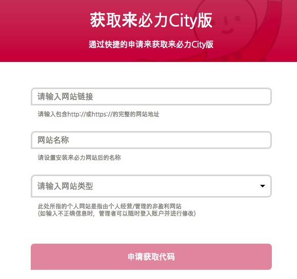
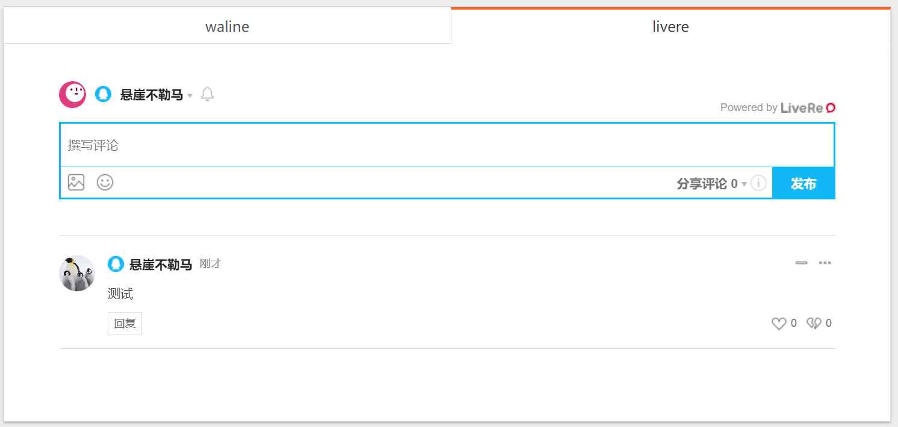
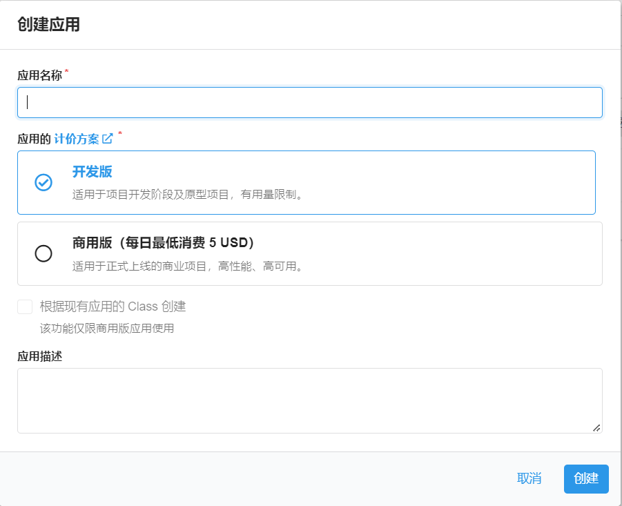
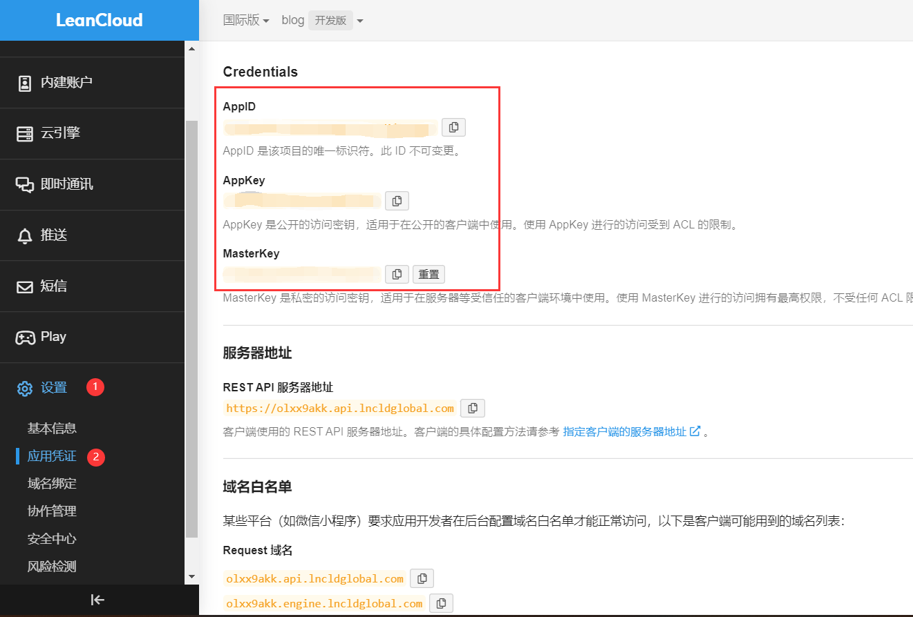
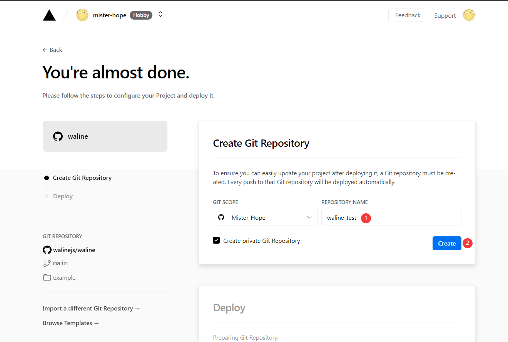
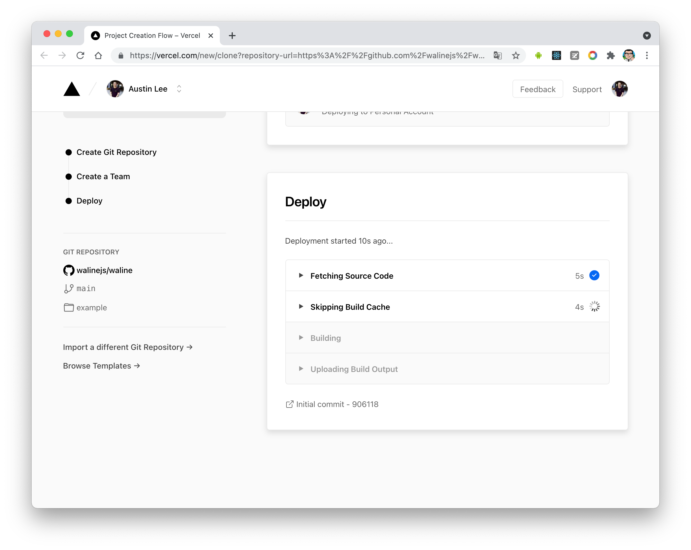
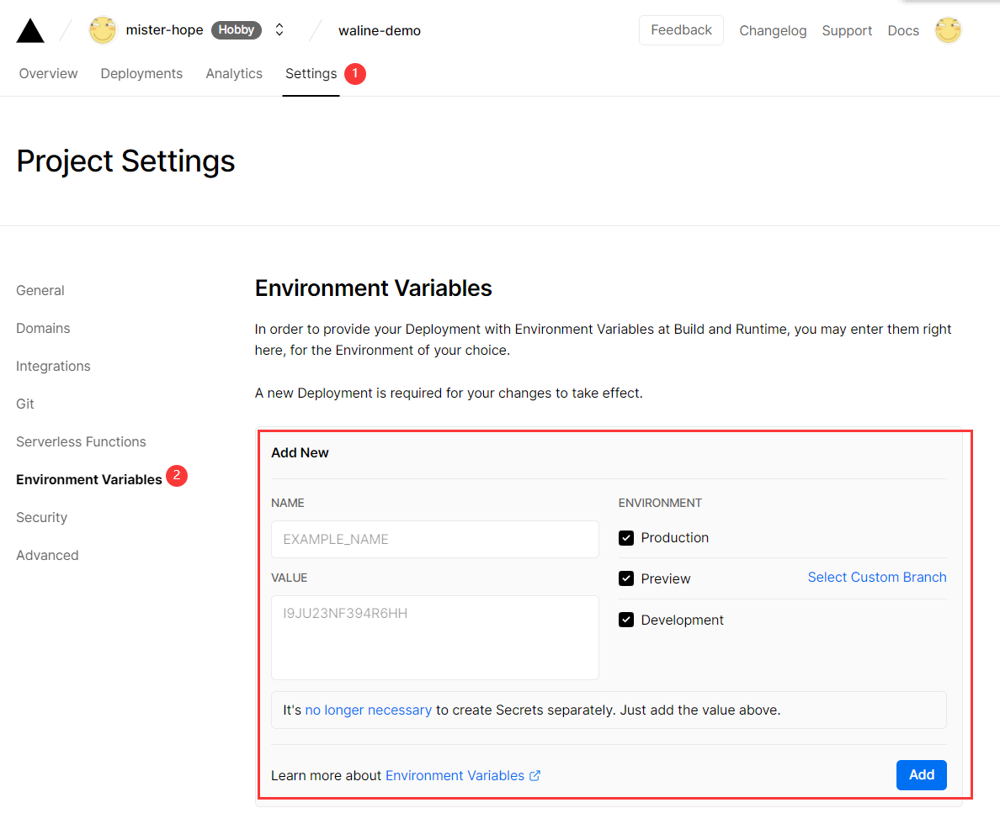
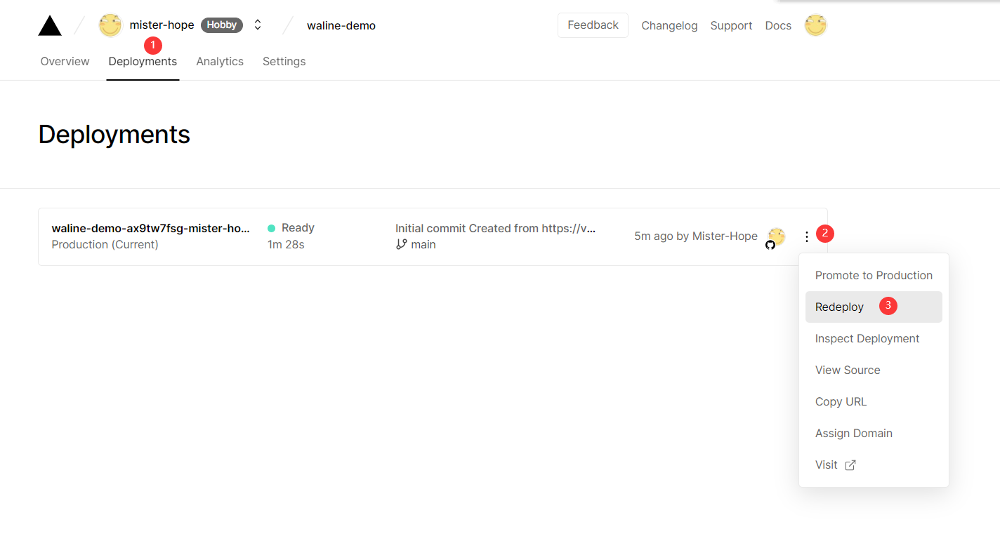
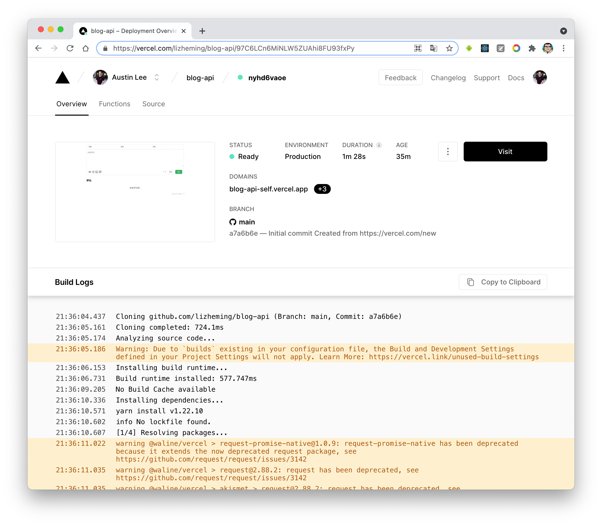
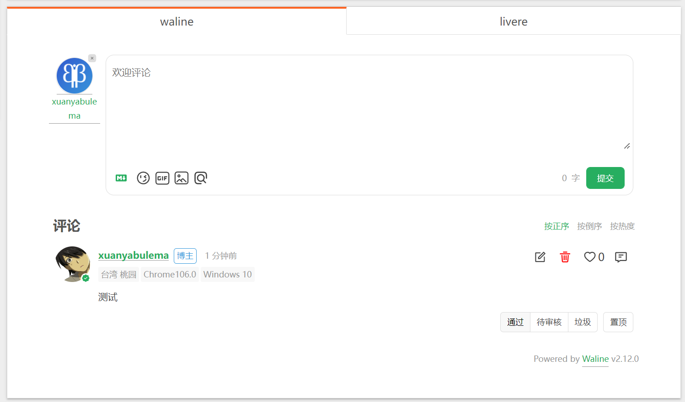

# 前言

为自己的Blog添加一个评论系统不仅有趣，也有利于交流。

Hexo支持多个评论系统同时启用，NexT主题默认支持`disqus | disqusjs | changyan | livere | gitalk | utterances`等评论系统

```yaml
# Available values: disqus | disqusjs | changyan | livere | gitalk | utterances
```

<!-- more -->

# LiveRe配置教程

最新版 [hexo-theme-next](https://github.com/next-theme/hexo-theme-next) 已经包含 LiveRe 插件，下载最新版本，配置 `livere_uid` 即可使用。

##  注册 LiveRe

进入 [LiveRe](https://livere.com/)，注册账号。

LiveRe 有两个版本：

1. City 版：是一款适合所有人使用的免费版本；
2. Premium 版：是一款能够帮助企业实现自动化管理的多功能收费版本。

安装，获取 `uid`：



填写（都可以随便填写）完成后，进入到 `管理页面 -> 代码管理 -> 一般网站` 代码中，`data-uid` 即为所需 `uid`。

## 配置 LiveRe

找到NexT主题配置文件，在其中填写`uid`即可

```yaml
# LiveRe comments system
# You can get your uid from https://livere.com/insight/myCode (General web site)
livere_uid: # <your_uid>
```



# Waline配置教程

>[Waline快速上手](https://waline.js.org/guide/get-started.html)

##  LeanCloud 设置 (数据库)

1. [登录](https://console.leancloud.app/login) 或 [注册](https://console.leancloud.app/register) `LeanCloud 国际版` 并进入 [控制台](https://console.leancloud.app/apps)

2. 点击左上角 [创建应用](https://console.leancloud.app/apps) 并起一个你喜欢的名字 (请选择免费的开发版):

   

3. 进入应用，选择左下角的 `设置` > `应用 Key`。你可以看到你的 `APP ID`,`APP Key` 和 `Master Key`。请记录它们，以便后续使用。

   

## Vercel 部署 (服务端)

[Dyploy](https://vercel.com/new/clone?repository-url=https%3A%2F%2Fgithub.com%2Fwalinejs%2Fwaline%2Ftree%2Fmain%2Fexample)

1. 点击上方，跳转至 Vercel 进行 Server 端部署。

   > 注
   >
   > 如果你未登录的话，Vercel 会让你注册或登录，请使用 GitHub 账户进行快捷登录。

2. 输入一个你喜欢的 Vercel 项目名称并点击 `Create` 继续:

   

3. 此时 Vercel 会基于 Waline 模板帮助你新建并初始化仓库，仓库名为你之前输入的项目名。

   

   一两分钟后，满屏的烟花会庆祝你部署成功。此时点击 `Go to Dashboard` 可以跳转到应用的控制台。

   

4. 点击顶部的 `Settings` - `Environment Variables` 进入环境变量配置页，并配置三个环境变量 `LEAN_ID`, `LEAN_KEY` 和 `LEAN_MASTER_KEY` 。它们的值分别对应上一步在 LeanCloud 中获得的 `APP ID`, `APP KEY`, `Master Key`。

   

   >注
   >
   >如果你使用 LeanCloud 国内版，请额外配置 `LEAN_SERVER` 环境变量，值为你绑定好的域名。

5. 环境变量配置完成之后点击顶部的 `Deployments` 点击顶部最新的一次部署右侧的 `Redeploy` 按钮进行重新部署。该步骤是为了让刚才设置的环境变量生效。

   

6. 此时会跳转到 `Overview` 界面开始部署，等待片刻后 `STATUS` 会变成 `Ready`。此时请点击 `Visit` ，即可跳转到部署好的网站地址，此地址即为你的服务端地址。

   

## 在Hexo Next主题中配置

由于 Next 主题中并不自带 `Waline` 的评论配置，我们需要安装官方提供的插件。在 `Hexo` 根目录执行：

```sh
npm install @waline/hexo-next
```

找到 Next 的主题配置文件，在最后加上

```yaml
# Waline
# For more information: https://waline.js.org, https://github.com/walinejs/waline
waline:
  enable: true #是否开启
  serverURL: waline-server-pearl.vercel.app # Waline #服务端地址，我们这里就是上面部署的 Vercel 地址
  placeholder: 请文明评论呀 # #评论框的默认文字
  avatar: mm # 头像风格
  meta: [nick, mail, link] # 自定义评论框上面的三个输入框的内容
  pageSize: 10 # 评论数量多少时显示分页
  lang: zh-cn # 语言, 可选值: en, zh-cn
  # Warning: 不要同时启用 `waline.visitor` 以及 `leancloud_visitors`.
  visitor: false # 文章阅读统计
  comment_count: true # 如果为 false , 评论数量只会在当前评论页面显示, 主页则不显示
  requiredFields: [] # 设置用户评论时必填的信息，[nick,mail]: [nick] | [nick, mail]
  libUrl: # Set custom library cdn url
```

重新部署 `Hexo` ，就可以看到结果了。

> 据反馈，Hexo 似乎在 8.x 的版本使用 waline 比较稳定，如果出现 `hexo g` 出错，可尝试升级 hexo 版本。

## 登录服务端

由于 `Waline` 有服务端，支持评论管理。我们需要注册一个账号作为管理员。

找到评论框，点击 `登录` 按钮，会弹出一个窗口，找到用户注册，默认第一个注册的用户为管理员，所以部署好一定要记得及时注册。



注册好，登录之后即可进入评论管理的后台，可以对评论进行管理。
