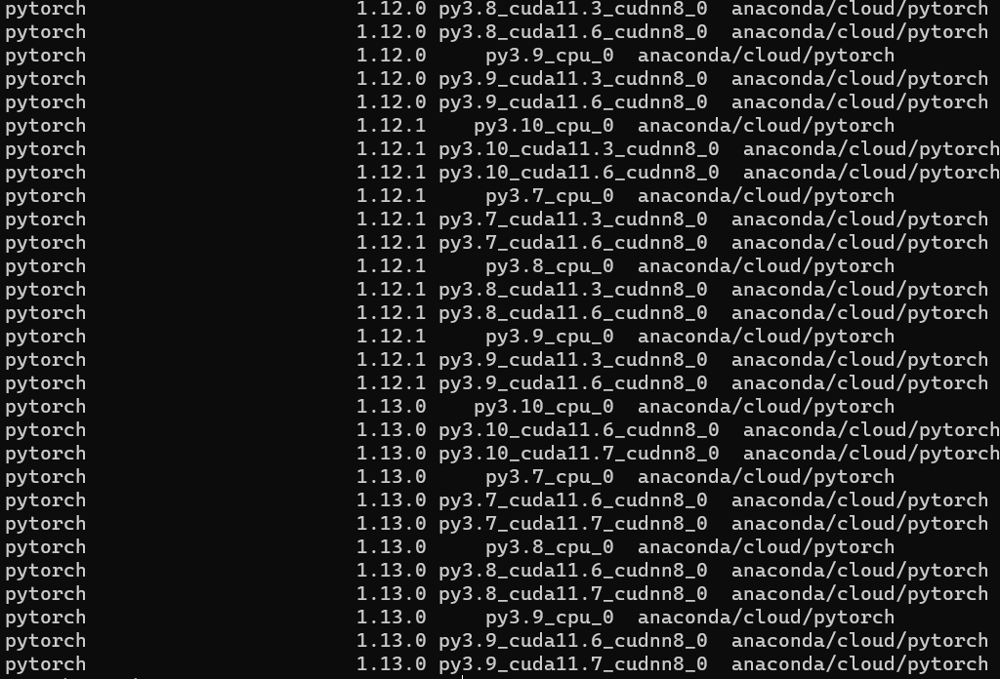
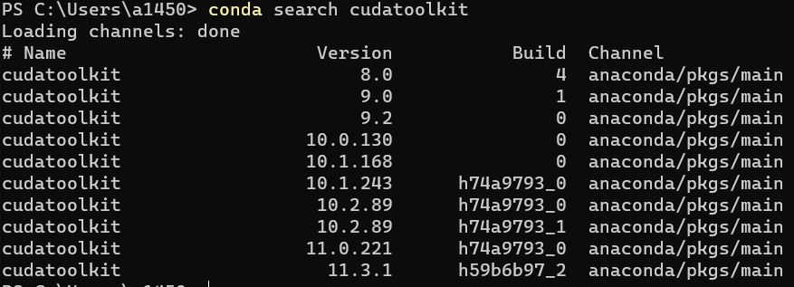
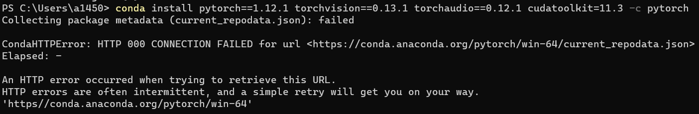
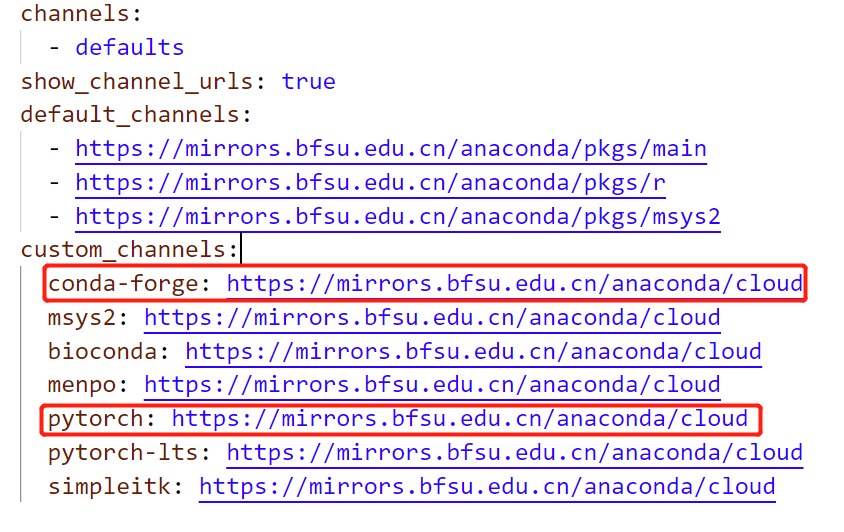

# Anaconda配置源

## [清华大学开源软件镜像站](https://mirrors.tuna.tsinghua.edu.cn/)

> https://mirrors.tuna.tsinghua.edu.cn/help/anaconda/

<!-- more -->

我的配置如下

```
channels:
  - defaults
show_channel_urls: true
default_channels:
  - https://mirrors.tuna.tsinghua.edu.cn/anaconda/pkgs/main
  - https://mirrors.tuna.tsinghua.edu.cn/anaconda/pkgs/r
  - https://mirrors.tuna.tsinghua.edu.cn/anaconda/pkgs/msys2
custom_channels:
  conda-forge: https://mirrors.tuna.tsinghua.edu.cn/anaconda/cloud
  msys2: https://mirrors.tuna.tsinghua.edu.cn/anaconda/cloud
  bioconda: https://mirrors.tuna.tsinghua.edu.cn/anaconda/cloud
  menpo: https://mirrors.tuna.tsinghua.edu.cn/anaconda/cloud
  pytorch: https://mirrors.tuna.tsinghua.edu.cn/anaconda/cloud
  pytorch-lts: https://mirrors.tuna.tsinghua.edu.cn/anaconda/cloud
  simpleitk: https://mirrors.tuna.tsinghua.edu.cn/anaconda/cloud
```

## [北京外国语大学开源软件镜像站](https://mirrors.bfsu.edu.cn/)

> https://mirrors.tuna.tsinghua.edu.cn/news/bfsu-mirror/
>
> 北外镜像站作为 TUNA 镜像的姊妹站，由北外信息技术中心支持创办、清华 TUNA 协会运行维护，提供和 TUNA 镜像站基本一致的镜像内容，网络接入 CERNET2 IPv6 和中国移动 IPv4 线路，支持 HTTP/HTTPS/RSYNC 访问。如果您在使用 TUNA 镜像时遇到负载过高、速度过慢等问题，可以尝试切换至北外镜像站以获得更佳的体验。
>
> 对于在镜像使用中遇到的问题，您可以提交 [issue](https://github.com/tuna/issues/issues/new?labels=BFSU) 提出反馈或通过发送邮件到 [support@tuna.tsinghua.edu.cn](mailto:support@tuna.tsinghua.edu.cn) 联系我们。

> https://mirrors.bfsu.edu.cn/help/anaconda/

我的配置如下

```
channels:
  - defaults
show_channel_urls: true
default_channels:
  - https://mirrors.bfsu.edu.cn/anaconda/pkgs/main
  - https://mirrors.bfsu.edu.cn/anaconda/pkgs/r
  - https://mirrors.bfsu.edu.cn/anaconda/pkgs/msys2
custom_channels:
  conda-forge: https://mirrors.bfsu.edu.cn/anaconda/cloud
  msys2: https://mirrors.bfsu.edu.cn/anaconda/cloud
  bioconda: https://mirrors.bfsu.edu.cn/anaconda/cloud
  menpo: https://mirrors.bfsu.edu.cn/anaconda/cloud
  pytorch: https://mirrors.bfsu.edu.cn/anaconda/cloud
  pytorch-lts: https://mirrors.bfsu.edu.cn/anaconda/cloud
  simpleitk: https://mirrors.bfsu.edu.cn/anaconda/cloud
```

## Mamba替代加速Conda

安装

```sh
conda install -c conda-forge mamba
```

使用`Mamba`时其实只要将原有的`Conda`语句中的`conda`替换为`mamba`即可

以安装`conda install numpy`，使用以下命令则可替代

```sh
mamba install numpy
```

## Conda安装指定版本库

可以先寻找一下有哪些版本

```sh
conda search pytorch
```



```sh
conda search cudatoolkit
```



然后可以指定一下`pytorch, cudatoolkit`版本，比如

```shell
conda install pytorch=1.12.0 torchvision torchaudio cudatoolkit=11.3
```


# pip配置源

清华源

> https://mirrors.tuna.tsinghua.edu.cn/help/pypi/

北外源

> https://mirrors.bfsu.edu.cn/help/pypi/

## pip安装指定版本的库

```shell
pip install matplotlib==3.4.3
```


# Pytorch安装

> https://pytorch.org/get-started/locally/

`Pytorch v1.12.1`官网的`conda`安装命令为（安装`CUDA 11.6`版本的`pytorch`）

```shell
conda install pytorch==1.12.1 torchvision==0.13.1 torchaudio==0.12.1 cudatoolkit=11.6 -c pytorch -c conda-forge
```

`-c pytorch`参数原本指定为Pytorch官网源进行安装，由于源在国外，若未更换`conda`源，国内安装pytorch等容易失败



在[配置上述Anaconda源后](#anaconda配置源)，即可顺利安装，因为若在conda源添加

```
custom_channels:
  pytorch: https://mirrors.bfsu.edu.cn/anaconda/cloud
  conda-forge: https://mirrors.bfsu.edu.cn/anaconda/cloud
```

`-c pytorch` `-c conda-forge`参数则指定到了国内源



## v1.13.0

```sh
# CUDA 11.6
conda install pytorch torchvision torchaudio pytorch-cuda=11.6 -c pytorch -c nvidia
# CUDA 11.7
conda install pytorch torchvision torchaudio pytorch-cuda=11.7 -c pytorch -c nvidia
```

## v1.12.1

```sh
# CUDA 10.2
conda install pytorch==1.12.1 torchvision==0.13.1 torchaudio==0.12.1 cudatoolkit=10.2 -c pytorch
# CUDA 11.3
conda install pytorch==1.12.1 torchvision==0.13.1 torchaudio==0.12.1 cudatoolkit=11.3 -c pytorch
# CUDA 11.6
conda install pytorch==1.12.1 torchvision==0.13.1 torchaudio==0.12.1 cudatoolkit=11.6 -c pytorch -c conda-forge
# CPU Only
conda install pytorch==1.12.1 torchvision==0.13.1 torchaudio==0.12.1 cpuonly -c pytorch
```

## v1.12.0

```sh
# CUDA 10.2
conda install pytorch==1.12.0 torchvision==0.13.0 torchaudio==0.12.0 cudatoolkit=10.2 -c pytorch
# CUDA 11.3
conda install pytorch==1.12.0 torchvision==0.13.0 torchaudio==0.12.0 cudatoolkit=11.3 -c pytorch
# CUDA 11.6
conda install pytorch==1.12.0 torchvision==0.13.0 torchaudio==0.12.0 cudatoolkit=11.6 -c pytorch -c conda-forge
# CPU Only
conda install pytorch==1.12.0 torchvision==0.13.0 torchaudio==0.12.0 cpuonly -c pytorch
```


# 个人常用库

pip安装

```sh
pip install opencv-python opencv-contrib-python pydicom nibabel pandas numpy dill matplotlib==3.4.3
```

conda安装

```sh
conda install numpy matplotlib=3.4.3
```


# OpenCV及其扩展模块

```shell
pip install opencv-python
pip install opencv-contrib-python
```


# pydicom

```shell
pip install pydicom
```


