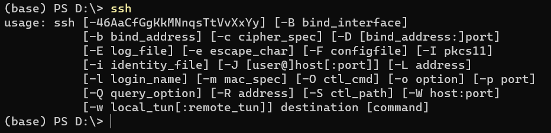
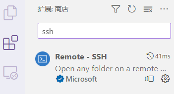
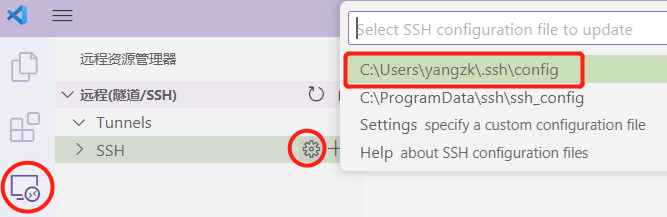
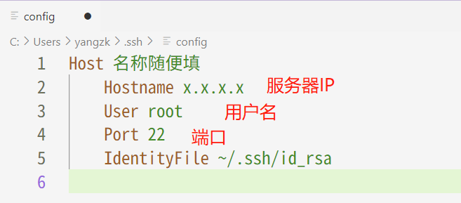
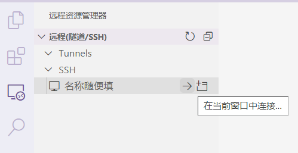

# 前言

配置 VScode 连接远程服务器进行开发

<!-- more -->

# 准备工作

## SSH 功能确认

Windows 通常自带 OpenSSH 不需要安装，Windows 下检查是否已经安装 OpenSSH 的方法：
启动 `Windows PowerShell（管理员）`，输入以下指令：

```powershell
Get-WindowsCapability -Online | ? Name -like 'OpenSSH*'
```

- 如果电脑未安装 OpenSSH，则 `State` 会显示 `NotPresent`：

  [则输入以下指令进行安装](https://learn.microsoft.com/en-us/windows-server/administration/openssh/openssh_install_firstuse?tabs=powershell)：

  ```powershell
  Add-WindowsCapability -Online -Name OpenSSH.Client~~~~0.0.1.0
  ```

- 若已安装或在安装完成后，输入 `ssh` 将会返回以下内容：

  

## VScode 安装 Remote-SSH

VScode 搜索并安装 Remote-SSH



# 配置 Remote-SSH

从如下图所示，打开并配置 config 配置文件，



配置如下：



# 连接远程服务器

在配置上述过程之后，可点击“→”按钮即可进行连接，连接过程中将会需要输入密码。


