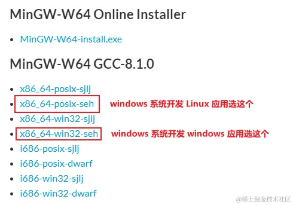

# MinGW 各版本参数 (Version、Architecture、Threads、Exception) 说明

<!-- more -->

> 
>
> - Version：指的是 GCC 编译器的版本，我选择的是当前最新版本 8.1.0，一般建议选择最新的版本；
> - Architecture：指的是电脑的系统类型，i686 表示的是 32 位的系统类型，x86_64 表示的是 64 位的系统类型；
> - Threads：指的是线程模型，posix 或 win32
>   - POSIX（Portable Operating System Interface，可移植操作系统接口），是 UNIX 系统的一个 API 设计标准，很多类 UNIX 系统也在支持兼容这个标准，如 Linux 操作系统。如果在 Windows 下开发 Linux 应用程序，则选择 posix；
>   - Win32，是 Windows 系统下一个 API 设计标准，如果开发 Windows 平台下的应用程序，就需要选择 Win32；
> - Exception：指的是异常处理模型。i686 系统架构有两种选择：dwarf 和 sjlj；x86_64 系统架构也有两种选择：seh 和 sjlj。
>
> ------
>
> **sjlj，seh，dwarf 三者的区别**：
>  在C++中有 `try…throw…catch`，当它执行这种结构时，它需要保存现场还原现场，而 sjlj，seh，dwarf 正是实现这类过程的三种方式。
>
> - sjlj 全称是 SetJump / LongJump，前者设还原点，后者跳到还原点。*可用于 32 位或者 64 位系统*。
> - seh（Structured Exception Handling，结构化异常处理）是 Borland 公司的，微软买了其专利使用权，它利用了 FS 段寄存器，将还原点压入栈，收到异常时再弹出。相较而言，sjlj 是 C 标准库就有的东西，seh 在 2014 年前是有专利的，从性能上说 seh 比 sjlj 快。*只用于64位系统*。
> - dwarf 只支持32位系统 – 没有永久的运行时间开销 – 需要整个调用堆栈被启用，这意味着exception不能被抛出，例如Windows系统DLL。
>
> > 综上所述：
> >  【x86_64 64位】
> >  1、seh 是新发明的，性能比较好，但不支持 32位。
> >  2、而 sjlj 则是古老的。只用于64位系统。
> >  3、sjlj 稳定性好，支持 32位和64位。
> >  因此，x86_64 系统架构的推荐使用 seh 的异常处理模型。
> >  【i686 32位】
> >  1、dwarf 只支持 32 位，但是 dwarf 的性能要优于 sjlj。
> >  2、sjlj 支持 32 位或64 位，
> >  因此，i686 系统架构的推荐使用 dwarf 的异常处理模型。

作者：学不可以已
链接：https://juejin.cn/post/7271101616253206563
来源：稀土掘金
著作权归作者所有。商业转载请联系作者获得授权，非商业转载请注明出处。
