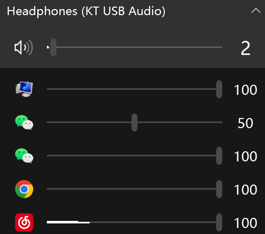
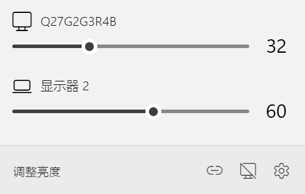
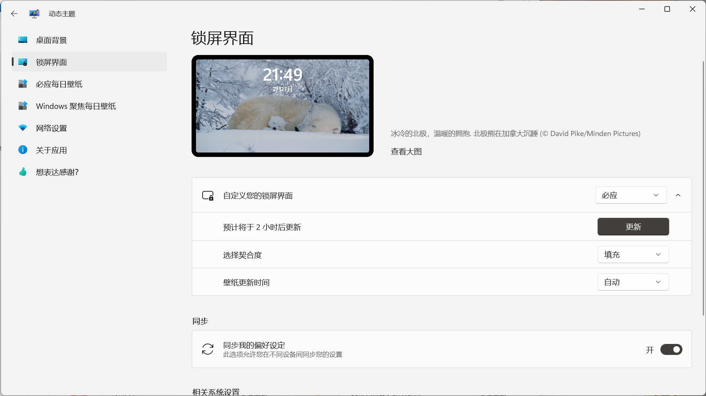

# 前言

Windows 虽然很强大，但是有些功能设计并不是很优秀，如音量调节，屏幕亮度调节等。幸好出现了优秀的开发者，做出了优秀的软件程序用于改善 Windows 的使用体验。

<!-- more -->

# EarTrumpet

[官网链接](https://eartrumpet.app/)

[EarTrumpet - Microsoft Store 应用程序](https://apps.microsoft.com/store/detail/eartrumpet/9NBLGGH516XP?cid=eartrumpet.landing)

EarTrumpet 是一款功能强大的 Windows 音量控制应用

# Twinkle Tray: Brightness Slider

[官网链接](https://twinkletray.com/)

[Twinkle Tray: Brightness Slider - Microsoft Store Apps](https://apps.microsoft.com/store/detail/twinkle-tray-brightness-slider/9PLJWWSV01LK?hl=en-us&gl=us)

Twinkle Tray让你轻松管理多个显示器的亮度水平。即使Windows 10和11能够调整大多数显示器的背光，它通常不支持外部显示器。Windows也缺乏管理多个显示器亮度的任何能力。这个应用程序在你的系统托盘中插入了一个新的图标，你可以点击它来即时访问所有兼容显示器的亮度水平。Twinkle Tray使用DDC/CI和WMI与你的显示器通信。请确保你的显示器上启用了适当的选项，以便它能与Twinkle Tray一起工作。

Twinkle Tray lets you easily manage the brightness levels of multiple monitors. Even though Windows 10 & 11 are capable of adjusting the backlight on most monitors, it typically doesn't support external monitors. Windows also lacks any ability to manage the brightness of multiple monitors. This app inserts a new icon into your system tray, where you can click to have instant access to the brightness levels of all compatible monitors. Twinkle Tray uses DDC/CI and WMI to communicate with your monitors. Make sure you have the appropriate option(s) enabled on your monitor so that it can work with Twinkle Tray.

# 动态主题（Dynamic theme）

[Dynamic Theme - Microsoft Store Apps](https://apps.microsoft.com/store/detail/dynamic-theme/9NBLGGH1ZBKW?hl=en-us&gl=us)

动态背景和/或锁屏图片，有每日必应或Windows Spotlight图片，一张必应或Windows Spotlight图片或个人图片。

Dynamic background and/or lock screen picture with daily Bing or Windows Spotlight pictures, one Bing or Windows Spotlight picture or personal pictures.

