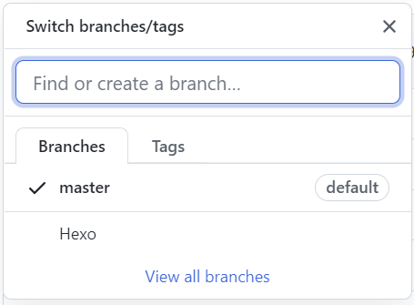
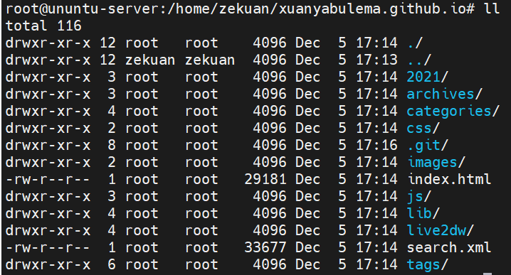

# 新建GitHub分支以保存Hexo源文件

<!-- more -->



# 将本地Hexo目录与GitHub的Hexo分支关联上

> 2022-10-17更新
>
> 建议新建一个私有仓库保存，防止token等泄露

先将`Hexo`分支文件clone到本地：

```shell
#git clone -b 分支名 仓库链接
git clone -b Hexo git@github.com:xuanyabulema/xuanyabulema.github.io.git
```

进入拷贝到本地的文件：

```shell
cd xuanyabulema.github.io/
```

用`ll`查看文件



删除`.git/`以外的所有文件

```shell
shopt -s extglob      #（打开extglob模式）
rm -fr !(.git/)  
# 如果是多个要排除的，可以这样：
# rm -rf !(file1|file2) 
```

将变化同步到GitHub

```shell
git add -A 
git commit -m "Hexo源文件同步"
git push origin 
```

将`.git/`移到你的本地Hexo源文件夹`blog`根目录下

```shell
mv xuanyabulema.github.io/.git/ blog/.git/
```

将目录下 themes 文件夹下每个主题文件夹里面的 .git .gitignore 删掉。

```shell
rm -rf .git/
rm -rf .gitignore
```

将变化同步到GitHub

```shell
git add -A 
git commit -m "Hexo源文件同步"
git push origin 
```

# 新环境配置与同步

## Ubuntu下配置

生成ssh key  

```shell
sudo ssh-keygen -t rsa -C "XXXX@email.com"
```

以我的为例

```shell
sudo ssh-keygen -t rsa -C "xuanyabulema@qq.com"
```

[查看秘钥并添加至GitHub](https://docs.github.com/cn/authentication/connecting-to-github-with-ssh/adding-a-new-ssh-key-to-your-github-account)

```shell
cat /root/.ssh/id_rsa.pub
```

然后将`cat`获取到的结果存至GitHub

验证是否连接成功

```shell
ssh -T git@github.com
```

## Windows下配置git

```powershell
ssh-keygen -t rsa -C "xuanyabulema@qq.com"
```


## 将Github上的Hexo源Blog文件同步到本地`./blog`目录下

个人使用的仓库同步命令

```shell
git clone git@github.com:xuanyabulema/Hexo.git ./blog
```

变更后同步到Github

```shell
git add -A && git commit -m "Hexo源文件同步" && git push origin 
```

其他端变更后同步到本地

```shell
git pull
```

## 安装Hexo环境

<a href="#hexo安装">之前写过Hexo安装</a>

安装Nodejs

```shell
# Using Ubuntu
curl -fsSL https://deb.nodesource.com/setup_lts.x | sudo -E bash -
sudo apt-get install -y nodejs
```

安装Hexo

```shell
sudo npm install -g hexo-cli 
```

安装nmp依赖

```shell
cd blog
npm install
```

修复一下 Hexo一级标题不跳转问题 hexo toc 插件问题

<a href="#hexo一级标题不跳转问题解决">之前写过，点击跳转查看，下面内容相同</a>

> > 解决方法参考：[hexo文章目录点击不跳转，html没有生成href](https://blog.csdn.net/weixin_45149481/article/details/116794535)
>
> 确保`node_modules`目录下有`hexo-toc`，否则使用以下命令生成该目录
>
> ```shell
> npm install hexo-toc
> ```
>
> 然后修改该目录下的`node_modules\hexo-toc\lib\filter.js`的“28-31行”为如下
>
> ```js
> $title.attr('id', id);
> // $title.children('a').remove();
> // $title.html( '<span id="' + id + '">' + $title.html() + '</span>' );
> // $title.removeAttr('id');
> ```
>
