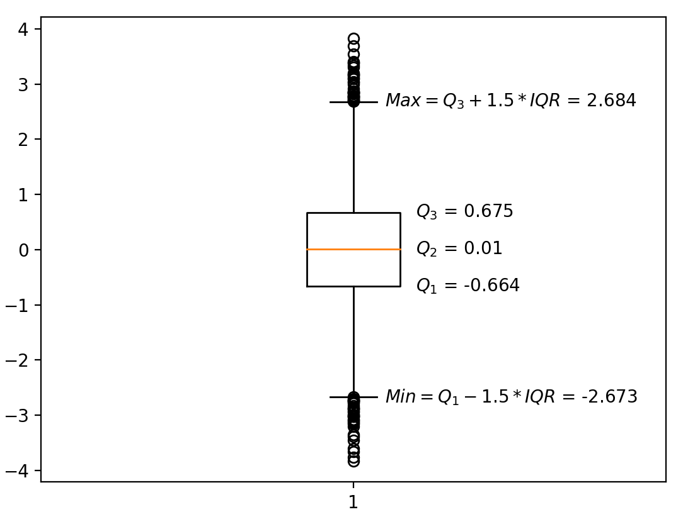

# 分位数

维基上的简介：

- **分位数**（英语：Quantile），亦称**分位点**，是指用分割点（cut point）将一个随机变量的概率分布范围分几个具有相同概率的连续区间。分割点的数量比划分出的区间少1，例如3个分割点能分出4个区间。
  - 常用的有中位数（即二分位数）、四分位数（quartile）、十分位数（decile ）、百分位数等。q-quantile是指将有限值集分为q个接近相同尺寸的子集。

<!-- more -->

- **四分位数**（英语：Quartile）是统计学中分位数的一种，即把所有数值由小到大排列并分成四等份，处于三个分割点位置的数值就是四分位数。

  - **第一四分位数**（$Q_1$），又称**较小四分位数**，等于该样本中所有数值由小到大排列后第25%的数字。

  - **第二四分位数**（$Q_2$），又称**中位数**，等于该样本中所有数值由小到大排列后第50%的数字。

  - **第三四分位数**（$Q_3$），又称**较大四分位数**，等于该样本中所有数值由小到大排列后第75%的数字。

    第三四分位数与第一四分位数的差距又称四分位距（InterQuartile Range, IQR）。

- **百分位数**（percentile）是统计学术语，若将一组数据从小到大排序，并计算相应的累计百分点，则某百分点所对应数据的值，就称为这百分点的百分位数，以$P_k$表示第$k$百分位数。百分位数是用来比较个体在群体中的相对地位量数。

## 分位数计算numpy.quantile、nmpy.percentile

`numpy.quantile`，`nmpy.percentile`都可用于计算四分位数和百分位数

**注意**：`Numpy`里的分位数计算为 $N-1$，$N$ 为数据个数，第一个数的位置为 $0$，第二个数的位置为 $1$，位置
$$
Q_i=\frac{i}{4}(N-1)
$$
若 $Q_i$ 不是整数，而是分数，则为临近两数的线性组合

示例分析

```python
import numpy as np

score = [2710, 2755, 2850, 2880, 2880, 2890, 2920, 2940, 2950, 3050, 3130, 3325]

quantile10 = np.quantile(score, q=0.1, method='linear')  # q取值范围[0, 1]
percentile10 = np.percentile(score, 10)  # 取值范围[0,100]
quantile25 = np.quantile(score, q=0.25, method='linear')
quantile75 = np.quantile(score, q=0.75, method='linear')

print('10%-q:', quantile10)  # 10%-q: 2764.5
print('10%-q:', percentile10)  # 10%-q: 2764.5
print('25%-q:', quantile25)  # 25%-q: 2872.5
print('75%-q:', quantile75)  # 75%-q: 2975.0
```

数据`[2710, 2755, 2850, 2880, 2880, 2890, 2920, 2940, 2950, 3050, 3130, 3325]`个数 $N=12$，

第一四分位数位置$\frac{1}{4} \times (12-1)=2.75$，第一个数的位置为 $0$，第二个数的位置为 $1$，

距离位置 $2$ 的数 $2850$ 为 $0.75$，则线性组合的系数为 $0.25$，距离 $3$ 的数 $2880$ 为 $0.25$，则线性组合的系数为$0.75$（为什么这样反过来选取，简单理解，靠近距离近的数，权重是不是应该大一些）
$$
Q_1=0.25 \times 2850 + 0.75\times2880 =2872.5
$$
10百分位数位置$\frac{10}{100} \times (12-1)=1.1$，
$$
0.9\times2755+0.1\times2850=2746.5
$$


# 箱线图（箱须图）

在描述性统计中，箱形图是一种通过数字数据的四分位数以图形方式展示其位置性、扩散性和偏度组的方法。

- $Q_1$：第一四分位数，也即第25百分位数
- $Q_2$：第二四分位数，也即第50百分位数
- $Q_3$：第三四分位数，也即第75百分位数
- $IQR=Q_3-Q_1$：四分位距
- 数据异常值（离群值：outliers）：大于$Q_3+1.5 \times IQR$和小于$Q_1-1.5 \times IQR$的值
- 上须（upper whisker）$Max$：
  - 有大于$Q_3+1.5 \times IQR$的异常值：$Max=Q_3+1.5 \times IQR$
  - 无大于$Q_3+1.5 \times IQR$的异常值：$Max$为数据最大值

- 下须（lower whisker）$Min$：
  - 有小于$Q_1-1.5 \times IQR$的异常值：$Min=Q_1-1.5 \times IQR$
  - 无小于$Q_1-1.5 \times IQR$的异常值：$Min$为数据最小值

## 绘制箱线图matplotlib.pyplot.boxplot



```python
import numpy as np
import matplotlib.pyplot as plt

x = np.random.normal(loc=0, scale=1, size=(10000))  # 正态分布，均值0 方差1
plt.figure(dpi=200)
plt.boxplot(x)

Q1 = np.quantile(x, q=0.25)
Q2 = np.quantile(x, q=0.5)
Q3 = np.quantile(x, q=0.75)
IQR = Q3 - Q1
print(f'Q1 = {Q1}\nQ3 = {Q3}\nIQR = {IQR}')
min = Q1 - 1.5 * IQR
max = Q3 + 1.5 * IQR
print(f'min = {min}\nmax = {max}')

plt.text(1.05, min, f'$Min = Q_1 - 1.5 * IQR$ = {np.round(min, 3)}', verticalalignment='center')
plt.text(1.05, max, f'$Max = Q_3 + 1.5 * IQR$ = {np.round(max, 3)}', verticalalignment='center')
plt.text(1.1, Q1, f'$Q_1$ = {np.round(Q1, 3)}', verticalalignment='center')
plt.text(1.1, Q2, f'$Q_2$ = {np.round(Q2, 3)}', verticalalignment='center')
plt.text(1.1, Q3, f'$Q_3$ = {np.round(Q3, 3)}', verticalalignment='center')
```
