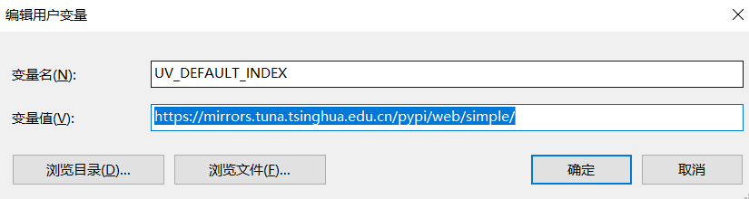

# 使用 uv 来管理 Python

`uv` 是一款用 Rust 编写的**极速 Python 包管理工具**，它集成了包管理、虚拟环境管理、依赖解析和 Python 版本控制等多种功能，旨在简化并统一 Python 的开发工作流。


<!-- more -->


下面的表格清晰地总结了 `uv` 的核心功能以及对应的命令示例，你可以快速了解它能为你做什么。

| 主要功能               | 命令示例                                     | 核心作用与优势                                               |
| :--------------------- | :------------------------------------------- | :----------------------------------------------------------- |
| **📦 包管理与项目管理** | `uv init`, `uv add requests`, `uv sync`      | 初始化项目，管理`pyproject.toml`和`uv.lock`锁文件，确保**依赖环境一致和可复现**。 |
| **🚀 极速安装**         | `uv pip install numpy pandas`                | 作为 `pip` 的直接替代品，凭借 Rust 底层和并行技术，安装速度比 `pip` **快10-100倍**。 |
| **🐍 Python 版本管理**  | `uv python install 3.12`, `uv python list`   | 轻松安装和切换不同版本的 Python 解释器，无需依赖其他工具。   |
| **🧰 工具管理 (`uvx`)** | `uvx cowsay "Hello"`, `uv tool install ruff` | 像 `pipx` 一样，在独立隔离环境中**一键运行或安装** Python 命令行工具（如 `ruff`, `black`），避免污染全局环境。 |
| **⚙️ 虚拟环境与运行**   | `uv run python main.py`                      | 自动创建并管理虚拟环境。无需手动激活，直接运行脚本，保证环境一致性。 |


# 🛠️ 从安装到上手

## 安装 uv

在 **Linux** 或 **macOS** 上，可以通过官方脚本安装：

```bash
curl -LsSf https://astral.sh/uv/install.sh | sh
```

或使用 `wget` 

```bash
wget -qO- https://astral.sh/uv/install.sh | sh
```

在 **Windows** 上，可以使用 PowerShell 安装：

```powershell
powershell -ExecutionPolicy ByPass -c "irm https://astral.sh/uv/install.ps1 | iex"
```

## 使用

安装个人常用包到**系统环境**

```powershell
uv pip install numpy pandas matplotlib==3.8.4 ipykernel seaborn scipy scienceplots openpyxl mplfonts --system
```

初始化 `mplfonts` 库，以解决方块字问题

```powershell
mplfonts init
```


##  配置国内加速

创建环境变量

变量名为

```
UV_DEFAULT_INDEX
```

变量值为

```
https://mirrors.tuna.tsinghua.edu.cn/pypi/web/simple/
```


