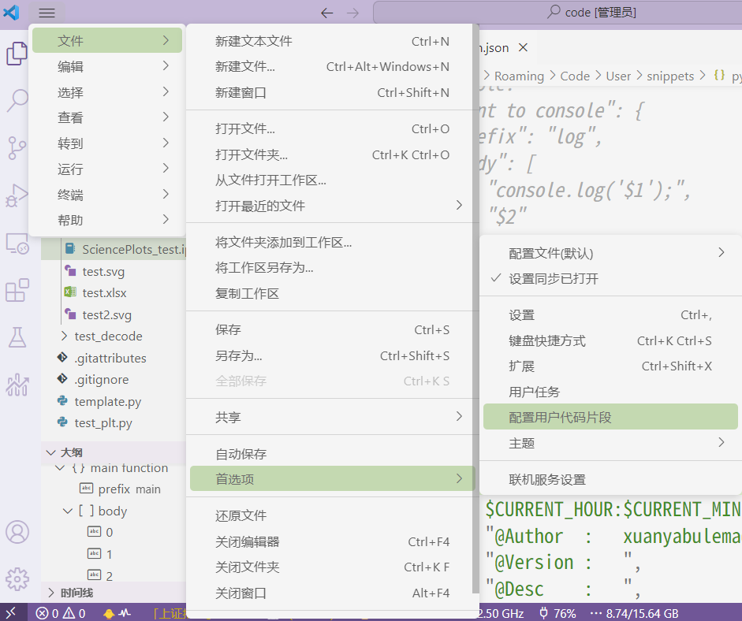
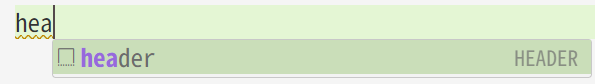
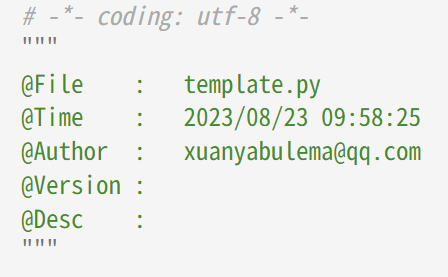

# 前言

在 VScode 配置 Python 代码模板

<!-- more -->

## 配置方式

文件——首选项——配置用户代码片段——选择 python，会生成并打开 python.json



修改为如下示例

```json
{
	// Place your snippets for python here. Each snippet is defined under a snippet name and has a prefix, body and 
	// description. The prefix is what is used to trigger the snippet and the body will be expanded and inserted. Possible variables are:
	// $1, $2 for tab stops, $0 for the final cursor position, and ${1:label}, ${2:another} for placeholders. Placeholders with the 
	// same ids are connected.
	// Example:
	// "Print to console": {
	// 	"prefix": "log",
	// 	"body": [
	// 		"console.log('$1');",
	// 		"$2"
	// 	],
	// 	"description": "Log output to console"
	// }
	"HEADER": {
		"prefix": "header",
		"body": [
			"# -*- coding: utf-8 -*-",
			"\"\"\"",
			"@File    :   $TM_FILENAME",
			"@Time    :   $CURRENT_YEAR/$CURRENT_MONTH/$CURRENT_DATE $CURRENT_HOUR:$CURRENT_MINUTE:$CURRENT_SECOND",
			"@Author  :   xuanyabulema@qq.com",
			"@Version :   ",
			"@Desc    :   ",
			"\"\"\"",
			"",
			"$0"
		],
		"description": "Python file header",
	},
	"main function": {
		"prefix": "main",
		"body": [
			"def main():",
			"    pass",
			"",
			"",
			"if __name__ == \"__main__\":",
			"    main()"
		],
		"description": "create python main function"
	},
	"for loop": {
		"prefix": "for",
		"body": [
			"for $1 in $2:",
			"    $0"
		],
		"description": "python for loop"
	},
}
```

## 使用方式

在 Python 文件中输入 "prefix" 对应的内容，如："header"，则会出现如下效果，



再按 Tab，即可输出对应的模板内容。


