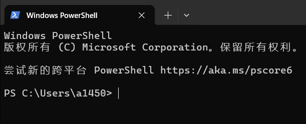
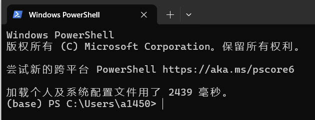
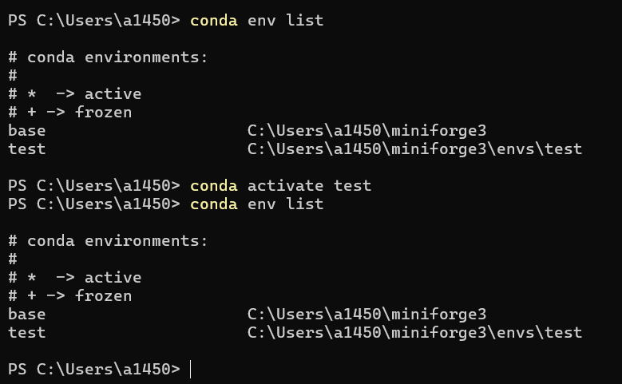
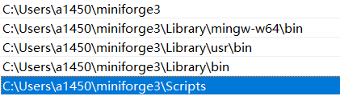
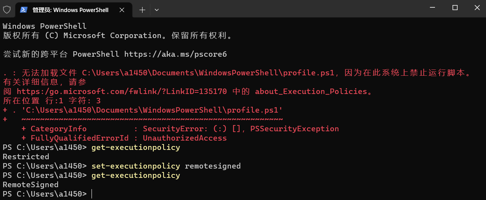
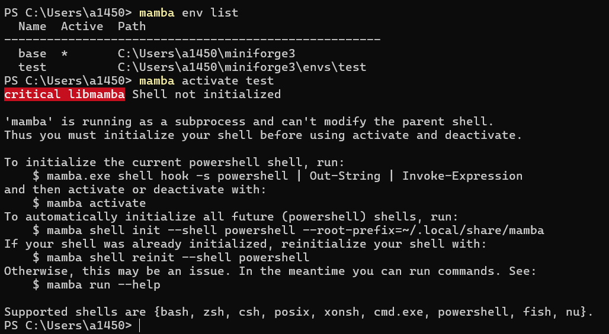

# 让 Windows 显示 Conda 环境名称

Windows 下安装完成 Conda 后，打开`PowerShell`，并不能像 Linux 下那样显示当前的 Conda 环境名称（安装后默认是`base`）。

<!-- more -->



## 实现方式

为了实现显示当前环境的效果，在 Windows 的终端上需要执行：

```powershell
conda init powershell
```

执行后，重新打开PowerShell，就能像 Linux 下那样显示当前的 Conda 环境名称。



## 必要性⚠️

若未执行上述命令，使用 `conda activate` 命令后可能无法激活环境，如下，未能显示成功激活的 `*` 标识



## 注意事项⚠️

- 确保可执行 Conda 命令，即你的 Conda 程序路径已添加到 Windows 环境变量。

  当下包含 Conda 的安装程序，在安装时勾选 "Add xxx to my PATH environment variable"即可，xxx 代表你的安装程序，我用的是miniforge，当然还有miniconda，Anaconda之类，可能存在些许差异。



- 确保可运行脚本

  `conda init powershell` 命令会修改 PowerShell 的启动配置文件 (`profile.ps1`)，使得每次打开 PowerShell 时自动初始化 Conda。Windows 默认情况是下是禁止运行脚本的，需使用如下命令修改策略

  ```powershell
  set-executionpolicy remotesigned
  ```



# 实现原理

执行 `conda init powershell` 时，Conda 会进行以下操作：

1. **配置文件的修改**：Conda 会在 PowerShell 的配置文件（一般是 `$PROFILE`）里添加一段初始化代码。你可以通过在 PowerShell 中输入 `$PROFILE` 来查看该文件的路径。
2. **钩子函数的注册**：添加的初始化代码主要包含一个钩子函数，其作用是在 PowerShell 启动时，自动设置 Conda 的运行环境。
3. **环境变量的动态设置**：当你激活或者退出某个环境时，钩子函数会动态地修改系统的环境变量，确保各种命令能够正确运行。

## 配置文件示例

执行 `conda init powershell` 后，PowerShell 配置文件中会新增类似下面的代码：

```powershell
#region conda initialize
# !! Contents within this block are managed by 'conda init' !!
If (Test-Path "C:\Users\你的用户名\miniforge3\Scripts\conda.exe") {
    (& "C:\Users\你的用户名\miniforge3\Scripts\conda.exe" "shell.powershell" "hook") | Out-String | ?{$_} | Invoke-Expression
}
#endregion
```

这段代码的作用是在 PowerShell 启动时，调用 Conda 的钩子函数，从而完成环境的初始化工作。


# 建议使用 Conda 管理，Manba用于安装库


# ~~让 Windows 显示 Manba 环境名称~~

> ~~Mamba 是一个**快速、轻量级的包管理和环境管理工具**，完全兼容 Conda。它的诞生主要是为了解决 Conda 在依赖解析时速度较慢的问题。~~
>
> ~~**核心优势与功能：**~~
>
> - ~~**极快的速度**：Mamba 使用 C++ 编写，并采用了更快的依赖解析器（libsolv）和支持并行下载，在解决环境依赖和包安装速度上通常显著快于 Conda。~~
> - ~~**与Conda命令高度兼容**：你基本上可以把 Mamba 视为 Conda 的一个**加速版替代品**。大部分常用的 Conda 命令（例如 `create`, `install`, `remove`）都可以直接将 `conda` 替换为 `mamba` 来使用。~~
> - ~~**高效的依赖管理**：能够快速处理复杂的包依赖关系，确保环境稳定性。~~
> - ~~**虚拟环境管理**：可以像 Conda 一样轻松创建、激活、管理和切换不同的 Python 虚拟环境，隔离项目依赖。~~

~~类似的，可以通过配置让 Windows 显示 Manba 环境名称，否则也可能无法使用 `mamba activate` 功能，如下~~

~~~~

~~根据上述提示，可以通过命令~~

```powershell
mamba shell init --shell powershell --root-prefix=~/.local/share/mamba
```

~~解决上述问题~~

## ~~注意⚠️ Mamba 创建的虚拟环境无法使用 Conda 管理，Conda 同理（个人测试结果）~~
