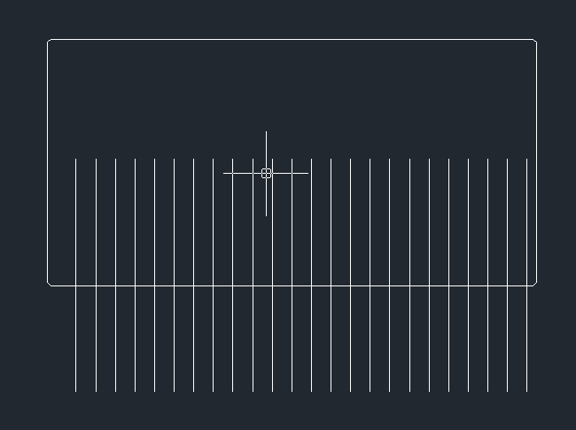
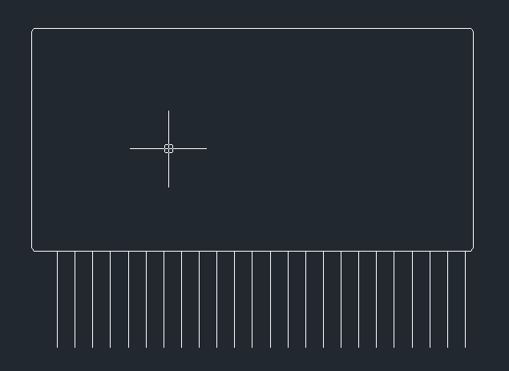

# 前言

通常 CAD 中的各图案无相互遮挡效果，但有时为了更好的呈现实际效果，需要图形之间的相互遮挡效果。

<!-- more -->

# wipeout 命令的使用

> [CAD的遮罩功能怎么用](https://www.zwsoft.cn/tutorial-gc/12431.html)
>
> [怎么用CAD实现图形遮挡效果](https://www.zwsoft.cn/tutorial-gc/15636.html)

如图所示，一排线段与一个近矩形多段线。

现需要使得矩形有遮挡线段的效果，可使用 `wipeout` 功能，在命令窗口输入`wipeout`后，在输入`p`，选择矩形的多段线

再根据需求，是否保留原有的多段线

最终获得有遮罩效果的图形

