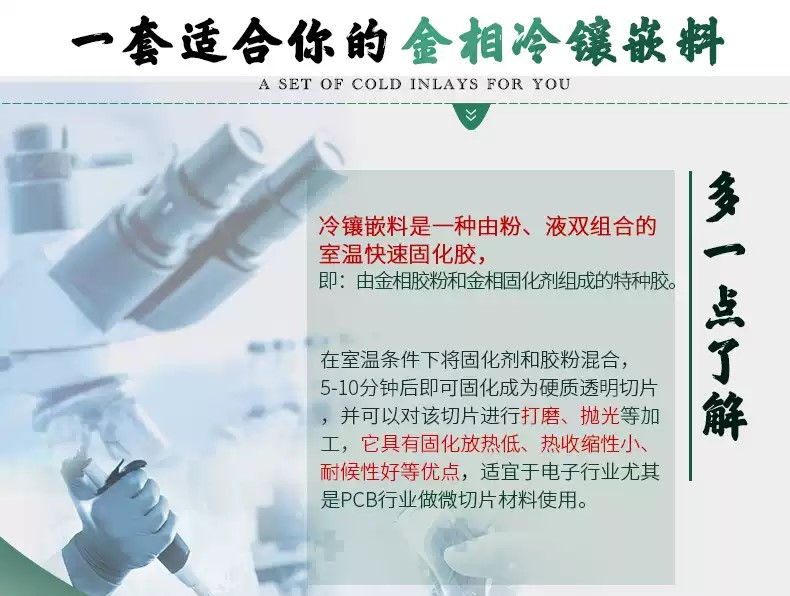
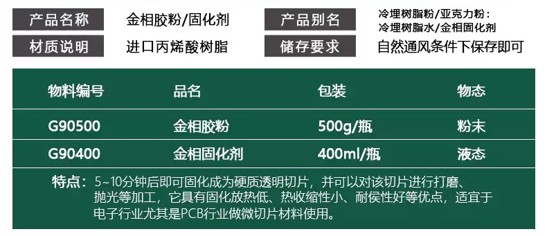
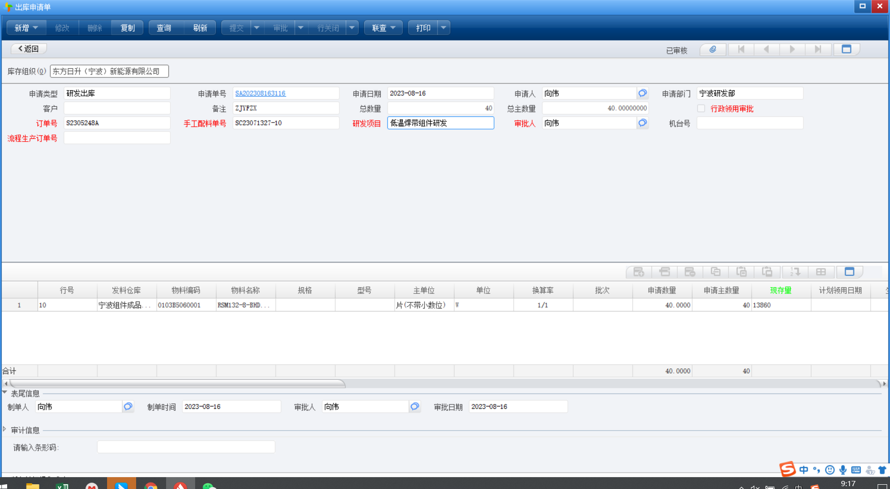
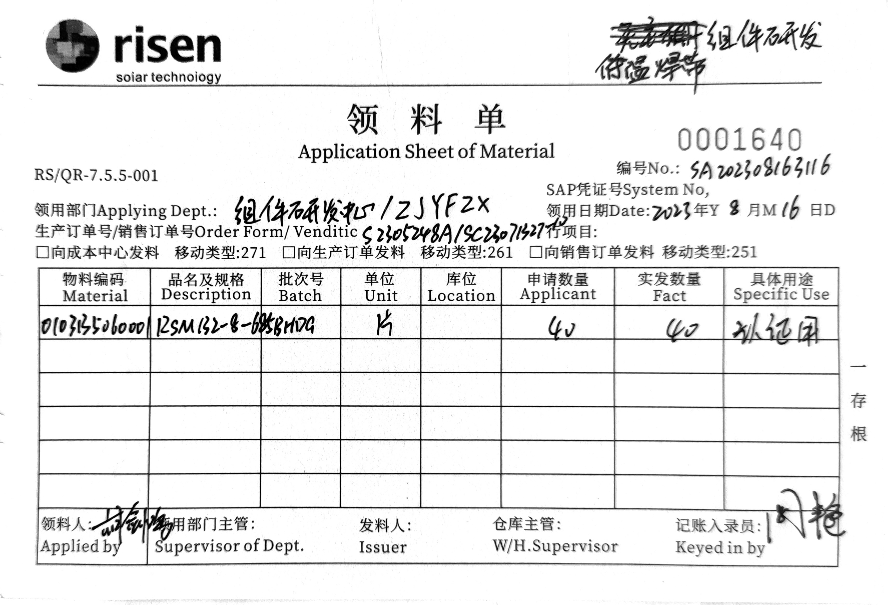
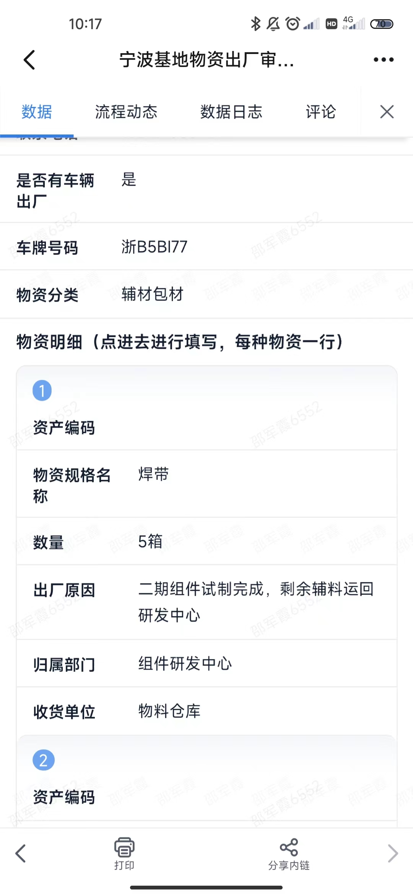
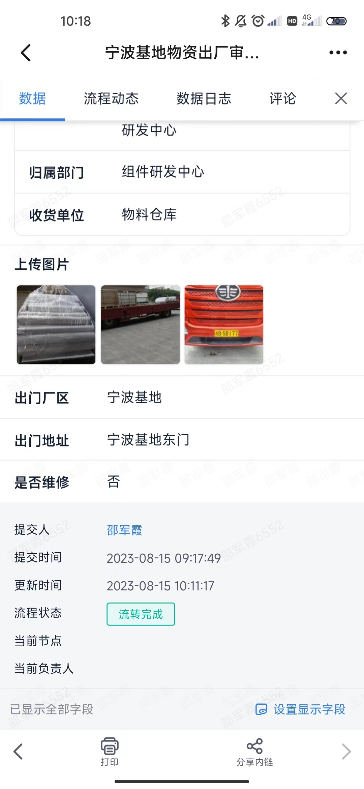
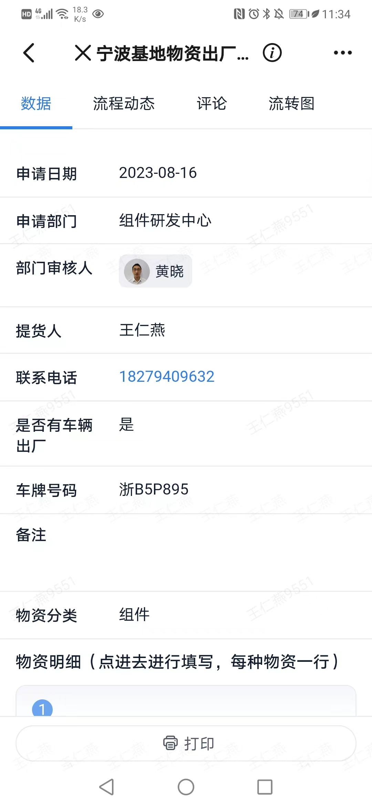
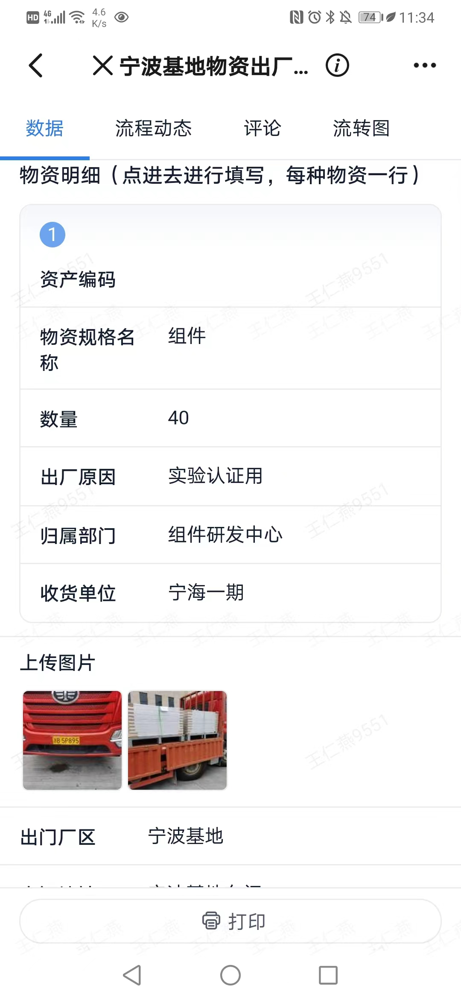
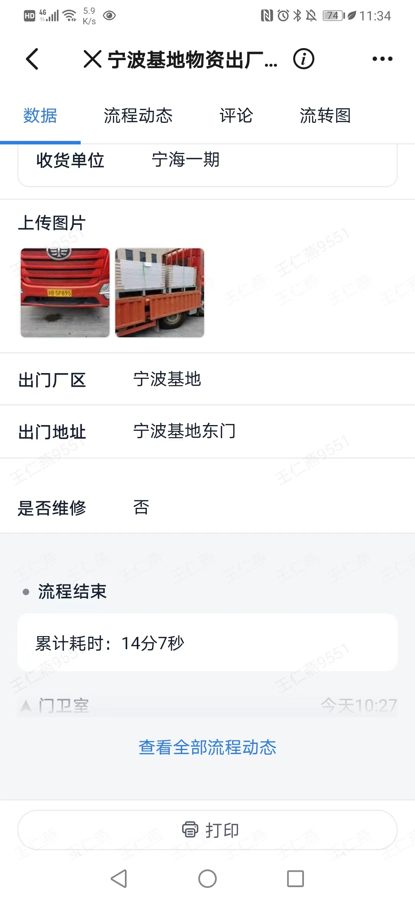

## 2023工作日志

<!-- more -->

##  Jul.

### Week 1

#### 07 18  Tues.

##### 手动焊接电路

> 1、先涂助焊剂
>
> 2、手动焊接注意事项
>
> - 烙铁温度要求
>   - 串返焊接温度 350±10°C
>   - 叠层烙铁温度 350±10°C
>   - 叠返焊接温度 350±10°C
>   - 安装接线盒焊接温度 380±10°C
> - 伏曦组件
>   - 焊带与焊带之间不超过 240°C
>   - 焊带与汇流条之间不超过 350°C
> - 备注
>   - 高温海绵更换频次/三天一次
>   - 叠层模板一天一清理
>   - 烙铁超过 10min 不使用或关闭电
>   - 烙铁后需在烙铁头部上锡保护

##### EL测试

EL=Electroluminescent，也就是电致发光，用于检测电池片（硅片）与组件的内部缺陷。

EL测试，俗称隐裂测试，是通过加在两电极的电压（50-60 V电压和 1-1.5 倍 $I_{sc}$ 的电流）产生电场，被电场激发的电子碰击发光中心而引致电子解级的跃进、变化、复合发出 1000-1100 nm 的红外光使用高清晰红外相机捕捉成像根据图片判定组件电池硅片内部质量的过程。

#### 07 19 Wed.

##### 新组件方案

通过先涂上胶水固定低温焊线，使得能够在层压的过程中，利用层压的温度实现焊接

#####  叠层

双玻：玻璃--胶膜--电池片--胶膜--玻璃

#####  层压

#### 07 20 Thurs.

抬板子

新材料胶膜（橙色）测试，胶膜静置一会，会收缩

#### 07 21 Fri.

### Week  2

#### 07 24 Mon.

##### 热斑测试

测试环境：

| 参数名称 |       数值        |
| :------: | :---------------: |
| 环境温度 |        25℃        |
| 模拟光照 | 1000 $\rm{w/m^2}$ |
|          |                   |

选取三片电流（温度）最高的，其中至少一片需在四周边框上，和一片电流（温度）最低的；

对以上四片，分别用 100%，90%，80%，…，10% 遮挡，每 5 分钟测一次温度并记录；

再在一小时内，每 10 分钟测试一次温度，若连续 3 次测量的温度变化在 1℃ 内，则稳定，否则继续晒 4 小时。

#### 07 25 Tues.

[旁路二极管热失控测试](https://zhuanlan.zhihu.com/p/94832100)

#### 07 26 Wed.

电流过载测试（非标准描述）

接线端受力测试（非标准描述）

湿漏电测试（非标准描述）

### Week 3

#### 07 31 Mon.

抬板

## Aug.

### Week 1

#### 08 04 Fri.

##### 层压温度探究试验

##### 培训：光伏组件产品认证简述

### Week 2

#### 08 07 Mon.

周会

南门测试组件安装

#### 08 09 Wed.

拆组件边框，观察气泡成因

#### 08 10 Thurs.

上午：组件切割，打磨查看

下午：测胶水材料（进行一半），移动便携el测试

晚上（加班）：夜间移动el测试

大组件分成两次拍，小组件一次拍

> 注意事项：
>
> 1、设备提示环境太暗，没关系；
>
> 2、相机成像面应尽可能平行组件平面，及光轴尽可能垂直组件屏幕；
>
> 3、应连接 lailx 的设备上的 WiFi；
>
> 4、曝光时间 6s；
>
> 5、iso100，200，320，看情况；
>
> 6、电源应该 60v，先点输出恢复，再点菜单重置调到 60v，然后再点输出。

#### 08 11 Fri.

上午：切割UV后的玻璃，打磨后用显微镜观察气泡产生的位置。结果：气泡产生于胶膜中间。

下午：胶膜验证，1、中间两块胶膜（溢出玻璃）x2；2、中间一块胶膜（溢出玻璃）x2；3、中间两块胶膜（未溢出玻璃，周围使用丁基胶围住）；4、中间一块胶膜（未溢出玻璃，周围使用丁基胶围住）。结果：

### Week 3

#### 08 14 Mon.

上午：同Shao由一期调胶膜焊带至二期，下午及晚上于二期裁胶膜

#### 08 15 Tues.

上午：从二期运回胶膜焊带到一期。流程：日升简道云--物资出厂申请（宁波基地）--拍照：1、车牌；2、出厂物资于车上照片。

下午：观察小牛和光远两台机子点胶的距离（焊机与电池片）。先用金相冷镶嵌料做固化切片后，进行观察。

>  金相冷镶嵌料是一种由粉、液双组合的室温快速固化胶，即：由金相胶粉和金相固化剂组成的特种胶。
>
>  在室温条件下将固化剂和胶粉混合5~10 分钟后即可固化成为硬质透明切片，并可以对该切片进行打、抛光等加工，它具有固化放热低、热收缩性小、耐候性好等优点，适宜于电子行业尤其是 PCB 行业做微切片材料使用。
>
>  
>
>  

#### 08 16 Wed.

上午：从二期调组件。

流程：1、找到组件；2、NC系统出库单；3、填写领料单；4、填写出厂单（事先通知审批领导大约几点要审批）

> 1、NC系统出库单示例；
>
> 
>
> 向伟NC账号看info.txt
>
> 2、领料单示例；
>
> 
>
> 3、出厂流程：
>
> 简道云——宁波基地出厂（从二期出厂，一期则为宁海基地）
>
> | 示例1 |  |  |                                                              |
> | ----- | :--------------------------------------------------------: | :----------------------------------------------------------: | :----------------------------------------------------------: |
> | 示例2 |  |  |  |

下午：

1、挑选组件（层压温度探究试验用，进行IEC测试）；

2、组件打包。[打包工具使用方式](https://zhuanlan.zhihu.com/p/280747841)

（个人使用：若网站失效，查看：下载的网页——手动塑钢带拉紧器，打包操作方法 - 知乎.mhtml）

#### 08 17 Thurs.

上午：清洗组件

下午：

1、去二期帮忙要层压件；

2、胶水拉力测试：电池片对折，撕下焊带用指甲钳剪下约 5cm 后去测试，25 个胶水点（有多少设置多少）。要求 0.1N 以上，一般胶水平均在 0.2N 以上，甚至 0.3N 以上。

#### 08 18 Fri. 

下午：测试4种胶水打串

#### 08 20

上午：测试四种胶水拉力。

A3-8-1、A3-8-2、A3-7-1、A3-7-2。
