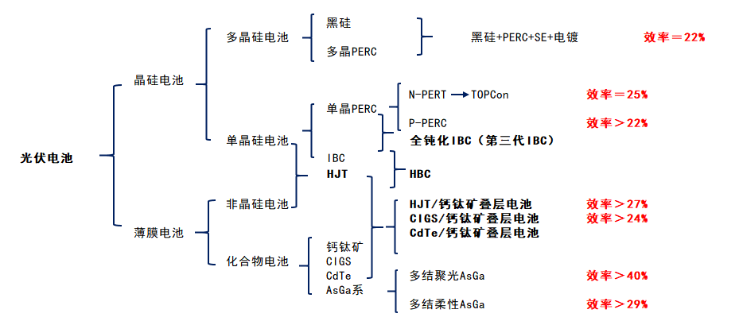
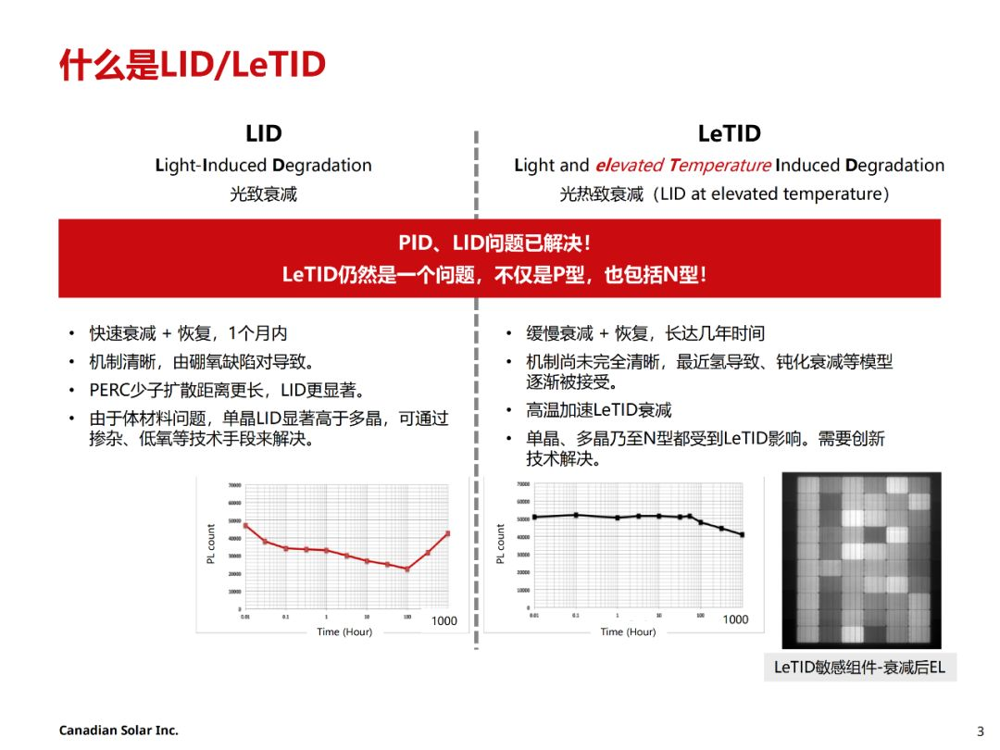
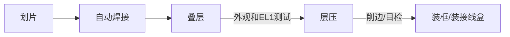

工作笔记

<!-- more -->

# 常见概念

根据**背板是否为玻璃**， 晶硅组件分为**单玻组件**和**双玻组件**

根据**电池芯片两面是否均能发电**，晶硅组件可进一步分为**单面组件**和**双面组件**，双面组件的电池芯片两侧均能够发电，电池芯片背面（即面向地面的 一侧）主要吸收地面反射光进行发电，根据背板材质和土地材质不同，双面组件的发电效率比单面组件高5%-19%。[参考](https://zhuanlan.zhihu.com/p/309990573)


## 光伏电池分类

[图片来源参考：2021-12-21](https://wallstreetcn.com/articles/3647836)



**TOPCon**：隧穿氧化层钝化接触技术。

TOPCon 电池是一种基于选择性载流子原理的隧穿氧化层钝化接触（Tunnel Oxide Passivated Contact）太阳能电池技术，其 电池结构为N型硅衬底电池，在电池背面结构为：超薄氧化硅+掺杂硅薄层，形成了钝化接触结构，有效降低表面复合和金属接触复合。电池背表面为H型栅线电极， 可双面发电。

**PREC**：钝化发射极背面电池

PERC (Passivated Emitter and Rear Cell) ，意思是"钝化发射器和后部接触 "的太阳能电池，被称为PERC太阳能电池片， 是从常规铝背场电池(BSF)结构自然衍生而来。

**HJT**：本征薄膜异质结


# 常见英文缩写

|  缩写  |                        英文                        |                 含义                  |
| :----: | :------------------------------------------------: | :-----------------------------------: |
| TOPCon |          Tunnel Oxide Passivated Contact           |          隧穿氧化层钝化接触           |
|  PERC  |          Passivated Emitter And Rear Cell          |          钝化发射极背面电池           |
|  HJT   |      Heterojunction with Intrinsic Thin Layer      |            本征薄膜异质结             |
|  IBC   |            Interdigitated Back Contact             |            交叉指式背接触             |
|  HBC   |            Heterojunction Back Contact             |             异质结背接触              |
|   EL   |                 Electroluminescent                 |               电致发光                |
|  MQT   |                Module Quality Test                 |             组件质量测试              |
|  MST   |                 Module Safety Test                 |             组件安全测试              |
|   TC   |                Thermal cycling test                |         热循环测试（MQT 11）          |
|   HF   |                Humidity-freeze test                |          湿冻试验（MQT 12）           |
|   DH   |                   Damp heat test                   |          湿热测试（MQT 13）           |
|  PID   |           Potential Induced Degradation            |        电位诱导衰减（MQT 21）         |
|  LID   |             Light-Induced Degradation              |               光致衰减                |
| LeTID  | Light And Elevated Temperature Induced Degradation |    光照及高温过程中引起的功率衰减     |
|   UV   |                    Ultraviolet                     | 紫外  <font color='red'>待补充</font> |
|   MC   |          <font color='red'>待补充</font>           |    <font color='red'>待补充</font>    |
|        |                                                    |                                       |

## LID vs LeTID

参考

> 20230801-TUV-可靠性标准机理及失效分析交流会议-LeTID test specification-Risen.pdf

| 光衰种类 | 电池片                             | 光衰原因                                                     | 特性                                                         | 消除方案                                                 |
| :------- | :--------------------------------- | :----------------------------------------------------------- | :----------------------------------------------------------- | :------------------------------------------------------- |
| LID      | 多发生于P型电池<br />常规单晶>多晶 | BO对（硼氧缺陷对）的形成                                     | 1、无硼消失,<br/>2、低氧下降<br/>3、随时间延长衰减逐渐增加，后趋于稳定 | 掺Ga，低氧工<br/>低剂量辐照+退火<br/>低剂量电流注入+退火 |
| LeTID    | 多发生PERC电池<br/>多晶>单晶       | 可能机理：<br/>1、金属杂质 （不同位置）<br/>2、背面钝化氢环境导致很多缺陷被氢钝化，光照和高温下氢键容易断裂 | 1、与B/O关系不大<br/>2、通常温度>50℃比较明显<br/>3、随时间延长衰减增加，后逐渐恢复，后趋于稳定<br/>4、测试温度越高，恢复越快 | 1、P/Al吸杂;<br/>2、降低烧结温度<br/>3、高强度激光退火   |

[参考](https://guangfu.bjx.com.cn/news/20200928/1107419.shtml)




# 组件编码方式

## 产品型号编码方式

|      |   XXX    |                             XXX                              |   -    |             X              |   -    |   XXX    |                             XXX                              |
| :--: | :------: | :----------------------------------------------------------: | :----: | :------------------------: | :----: | :------: | :----------------------------------------------------------: |
| 含义 | 日升组件 |                          电池片数量                          | 分隔符 |         电池片尺寸         | 分隔符 | 功率分档 |                           组件工艺                           |
| 示例 |   RSM    | 40<br/>60<br/>72<br/>100<br/>108<br/>110<br/>120<br/>144<br/>150<br/>81<br/>68<br/>132<br/>156 |   -    | 6<br/>7<br/>8<br/>9<br/>10 |   -    |   xxx    | M<br/>MDG<br/>BMDG<br/>HDG<br/>BHDG<br/>P<br/>PDG<br/>MI<br/>MB<br/>N<br/>NB<br/>BNDG<br/>NDGB<br/>HDGB<br/>BMTG |

参数释义

电池片尺寸

| 电池片尺寸 |              含义              |
| :--------: | :----------------------------: |
|     6      | 6 英寸 156.75 或 158.75 电池片 |
|     7      |           166 电池片           |
|     8      |           210 电池片           |
|     9      |           182电池片            |
|     10     |        192R 矩形电池片         |

组件工艺

| 组件工艺 |                含义                |
| :------: | :--------------------------------: |
|    M     |            单玻单晶组件            |
|   MDG    |          单面双玻单晶组件          |
|   BMDG   |          双面双玻单晶组件          |
|   HDG    |                                    |
|   BHDG   |         双面双玻异质结组件         |
|    P     |            单玻多晶组件            |
|   PDG    |          单面双玻多晶组件          |
|    MI    |            单晶智能组件            |
|    MB    |            单晶全黑组件            |
|    N     |       单玻 N 型 TOPCon 组件        |
|    NB    |     单玻 N 型 TOPCon 全黑组件      |
|   BNDG   |   单面/双面双玻 N 型 TOPCon 组件   |
|   NDGB   | 单面/双面双玻全黑 N 型 TOPCon 组件 |
|   HDGB   |      单面/双面双玻全黑异质结       |
|   BMTG   |        双面透明背板单晶组件        |


## 组件条码编码

|         XX          |         XX          |        XX        |     \|     |    XX    | XXXXX  |
| :-----------------: | :-----------------: | :--------------: | :--------: | :------: | :----: |
| 年代号：生产年份+25 | 月代号：生产月份+11 | 日代号：生产日期 | 防伪识别码 | 车间代号 | 流水号 |

例如：431201I0100001 代表 2018 年 1 月 1 日组件一车间生产的第一个组件。

# 组件制作流程



```mermaid
graph RL;
  装框/装接线盒-->固化-->清洗外观-->功率测试--安规测试--EL2测试-->分档-->包装
```

# 实验室测试流程

- OA 填写（材料）测试申请单
- 个人所在部门经理审批
- 实验室石经理审批
- 样品送至实验室门口，并放置测试申请单
- 实验室核对样品以及测试申请单
- 样品外观检查，无误后接受

# 光伏组件测试标准

## IEC61215

### MQT01  外观检测

不低于 1000 lux 的照度下，对每一个组件仔细检查

### MQT02  最大功率确定

最大功率确定  Maximum power determination

700~1100 $\rm{w/m^2}$

25~50℃

### MQT03 绝缘测试

确定模块在带电部件和可触及部件之间是否有充分的绝缘。

- 耐压

61215：$60s的1000+2*V_{sys}$

61730：$60s的2000+4*V_{sys}$

- 绝缘

$120s的V_{sys}$

### MQT04  温度系数的测量

测试点位数：$8$ （每 5℃一个点位）

温度区间：$25~60$℃

开路电压 $V_{oc}$ 系数字母为 $β$

短路电流 $I_{sc}$ 系数字母为 $α$

最大功率 $P_{max}$ 系数字母为 $γ$。

### MQT05

  标称模块工作温度(NMOT)测试

（在2021版意味着取消）

### MQT06  STC下的性能

确定在STC (1000 $\rm{w/m^2}$，25℃ 电池温度，IEC60904-3参考太阳光谱辐照度分布)下模块的电性能如何随负载变化。

根据SOP组件温度为25±1℃，测试光强为1000 $\rm{w/m^2}$，根据IEC61215-2:2016，组件温度为25±2℃，AM：1.5。

要求：

- 样品恒温：0.5h，可靠：4h，标片：24h

- 检查组件（标片）的外观
- 校准标片：$I_{sc},V_{oc},P_{max}$
- 连续闪三次，插拔线后，再闪一次，差值小与 0.5W
- 测被测组件
- 整理

### MQT07  低辐照度下的性能测试

测试光强200 $\rm{w/m^2}$，假如组件的实测功率为600W，低射照度下的测试值为116W，低辐照度系数为96.67%。

实测功率为600W时为1000 $\rm{w/m^2}$，则低辐照度系数=116/(600*200/1000)=96.67%

### MQT08  室外暴晒

在室外进行：在宁海，组件摆放角度为29±5°，光强需要达到至少500 $\rm{w/m^2}$以上才能采纳数据，累计辐照度达到$60\ \rm{kwh/m^2}$。

### MQT09  热斑耐久试验

Hot-spot endurance test

- 一块组件需要选取==4==片电池片，其中==3==片为漏电流最高的电池片，至少保证==1==片在边框附近，==1==片为漏电流最低电池片。
- 最佳阴影遮挡面积判定为阴影遮挡后的电流与组件初始状态下的==Impp==相近。如果二极管不启动的情况下，==100%或完全==遮挡面积为最坏遮挡面积。
- 测试时组件为==短路==状态（开路，短路，接负载），组件温度需在==50±10℃==，如光照一个小时后，电池片温度仍然在上升，需再进行==4==小时光照。

### MQT10  UV预处理试验

测试时组件温度为==（60±5）℃==，紫外累计辐照量需达到==$15 \ \rm{kwh/m^2}$==。UVA的波段为==320~400nm==，UVB的波段为==280~320nm==，根据IEC61215-2：2016，UVB含量占总UV的==3%~10%==。

### MQT11  热循环测试（TC）

测试温度为==-40℃到85℃==，组件在==-40℃~80℃==区间内通==Impp==电流，在其他区域通==小于1%Impp==电流。

### MQT12  湿冻测试（HF）

组件在==85℃ 85%RH==条件下需保持至少==20h==，在==-40℃==时需保持至少==30min==时间。测试过程中，需通==0.5%Impp==电流。

### MQT13  湿热测试（DH）

组件的测试环境条件为==85℃ 85%RH==需要防止组件的端子进水汽，从而可能产生影响组件功率的因素，测试后组件需在开路状态下23±5℃，相对湿度小于75%RH，恢复2~4小时。

### MQT14  引线端强度试验

**Retention of junction box on mounting surface**

### MQT15  湿漏电流试验

**Wet leakage current test**

水温==（22±2）℃==，电阻率==≤3500Ω/cm==，假设组件为2384*1103，限定电阻值为==15.20MΩ==，测试前设备应进行自检，测试时间为120s。

限定值计算，if 组件面积S<0.01，限定值为400MΩ，else 限定值为 40/S

### MQT16  机械载荷试验

**Static mechanical load test**

测试环境温度要求==（25±5）℃==，需对样品进行缓慢施压，测试期间监控电流不能中断，载荷均匀性要优于==5%==，且每个面要进行==3==小时施压。假设组件的设计载荷为2400Pa，安全因子为1.5，实际测试载荷为3600Pa。

### MQT17  冰雹试验

冰球制作需要在==（-10±5）℃==进行，冰球制作后需要在==（-4±2）℃==环境下，储存至少==1h==时间，且在==60s==时间内，完成冰球的测量，并发射。

冰球的直径、质量、速度的允差为==5%==。测速设备距离样品不得超过==1m==距离。

### MQT18  旁路二极管热性能测试

二极管需在==30℃、50℃、70℃、90℃==温度下，测试二极管==压降==，算出Ud和Tj的对应关系（最小二乘法）。然后再==75℃==下==$I_{sc}$==电流，持续==1h==时间，得出二极管压降Ud，套入上述的最小二乘法关系中，算的二极管结晶。

### MQT19  稳定性测试

测试时组件接负载状态（开路、短路、接负载）。测试时组件温度（50±10）℃，每次5kwh/m2累计辐照量，至少2次。评估组件是否达到电力稳定状态下功率输出的合格判据==$\frac{P_{max}-P_{min}}{P_{average}}<1 \rm{\%}$==。


## IEC61730

