工作笔记

<!-- more -->

# 常见概念

根据**背板是否为玻璃**， 晶硅组件分为**单玻组件**和**双玻组件**

根据**电池芯片两面是否均能发电**，晶硅组件可进一步分为**单面组件**和**双面组件**，双面组件的电池芯片两侧均能够发电，电池芯片背面（即面向地面的 一侧）主要吸收地面反射光进行发电，根据背板材质和土地材质不同，双面组件的发电效率比单面组件高5%-19%。[参考](https://zhuanlan.zhihu.com/p/309990573)

## 组件单瓦发电量

组件单瓦发电量是指光伏组件在**实际运行环境中**，每瓦额定功率在单位时间内（如一天、一年）所产生的平均发电量，通常以**千瓦时每千瓦**（$\rm{kWh/kW}$）为单位表示。

- 单瓦发电量反映的是组件**实际发电能力**，而非实验室标准条件（STC，如 25℃、1000W/㎡辐照）下的额定功率。
- 例如：一块额定功率为 300W 的组件，若一天实际发电 1.2kWh，则单瓦发电量为 1.2kWh ÷ 300W = 4kWh/kW（即每瓦额定功率一天发电 4 度）。

# 晶体、非晶体

| **对比维度** | **晶体**                                         | **非晶体**                     |
| ------------ | ------------------------------------------------ | ------------------------------ |
| **原子排列** | 长程有序（原子周期性规则排列）                   | 长程无序（仅短程局部有序）     |
| **几何外形** | 天然具有规则几何外形（如立方体、六方柱）         | 无固定几何外形，呈不规则形态   |
| **熔点**     | 有固定熔点（熔化时温度不变）                     | 无固定熔点（加热逐渐软化熔化） |
| **物理性质** | 各向异性（不同方向性能不同，如导电性、热膨胀性） | 各向同性（各方向性能均匀一致） |
| **常见示例** | 单晶硅、食盐、钻石、冰                           | 玻璃、松香、沥青、非晶硅、橡胶 |

## 单晶、多晶、非晶

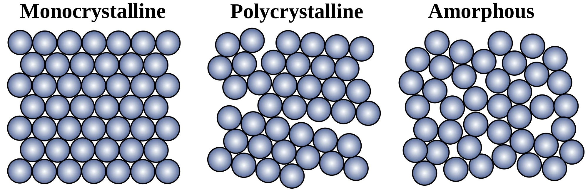

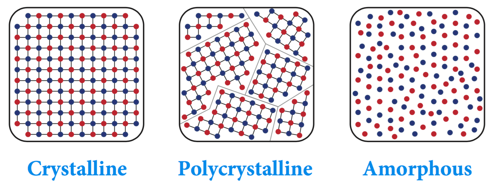

| 类型                          | 定义                   | 原子排列                   | 晶界情况   | 典型示例               |
| ----------------------------- | ---------------------- | -------------------------- | ---------- | ---------------------- |
| **单晶 Monocrystalline** | 完整晶体，单一晶格结构 | 长程有序                   | 无         | 单晶硅、钻石、蓝宝石   |
| **多晶 Polycrystalline** | 由多个晶粒组成的晶体   | 短程有序，长程因多晶粒无序 | 存在晶界   | 多晶硅、金属钢材、陶瓷 |
| **非晶 Amorphous**       | 无长程有序结构的材料   | 长程无序                   | 无明确晶界 | 玻璃、非晶硅、橡胶     |

## 本征非晶硅、单晶硅、多晶硅

| **参数**     | **本征非晶硅（i-a-Si）**     | **单晶硅（c-Si）** | **多晶硅（poly-Si）**            |
| ------------ | ---------------------------- | ------------------ | -------------------------------- |
| **结构**     | 短程有序、长程无序（非晶态） | 长程有序的单晶结构 | 多晶态，由小单晶晶粒组成，含晶界 |
| **代表字母** | **i-a-Si**                   | **c-Si**           | **poly-Si**                      |

**代表字母**

- **i-a-Si**：**i**（intrinsic） 代表本征（无掺杂），**a-Si** 为非晶硅（Amorphous Silicon）。
- **c-Si**：**c** 代表晶态（Crystalline），通常指单晶硅。
- **poly-Si**：**poly** 代表多晶（Polycrystalline）。

# 能带

能带图中，电子向上能量增加，空穴向下能量增加

# 晶硅电池光电效应阈值

晶体硅在室温下的禁带宽度约为 1.155eV， 必须波长小于 1100nm 的光线才可以使晶体硅产生光电效应。

# 光伏电池分类图

[图片来源参考：2021-12-21](https://wallstreetcn.com/articles/3647836)

# 电池结构

> [太阳能电池结构 | PVEducation](https://www.pveducation.org/zh-hans/pvcdrom/太阳能电池结构)
>
> > 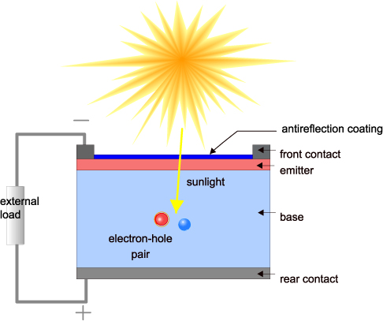
> >
> > *太阳能电池的横截面。注意：发射极（Emitter）和基极（Base）是历史术语，在现代太阳能电池中没有意义。我们仍然使用这些术语是因为还没有任何简洁的替代名称。发射极和基极在文献中非常常见，它们是表示 p-n 结中各层功能的很有用的术语。光首先进入发射器。发射极通常很薄，为了将耗尽区尽量保持在光被强烈吸收的位置，而基极通常做得足够厚，以吸收大部分光。* 

# 二极管（PN结）IV特性

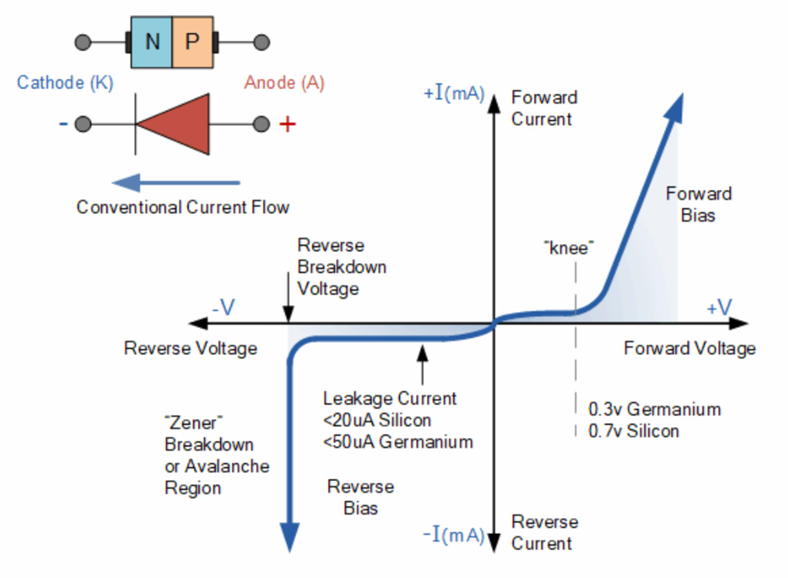

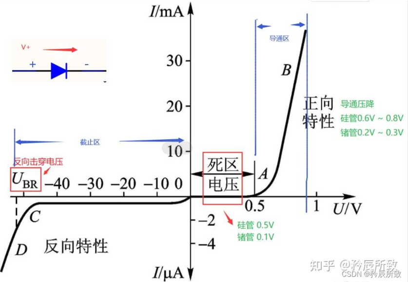

**理想二极管IV特性**：单向导通，正向导通，反向截止（不导通）

**实际二极管IV特性**：

- 正向特性（正向偏压）：电压超过死区电压（“knee”）后，才导通，电流急剧增加
  - 导通电压：锗：0.3V，硅：0.7V

- 反向特性（反向偏压）：反向偏压小于反向击穿电压截止，几乎不导通，存在极小漏电流。电压超过反向击穿电压，电流急剧增加
  - 漏电流：硅： < 20μA，锗：<50μA
  - 反向击穿（Reverse Breakdown）：齐纳击穿或雪崩齐纳，可逆（非破坏性）

# 目前光伏行业提高电池转换效率主要有以下几种方案

> 丁东.晶硅TOPCon与IBC太阳电池设计、制备与性能[D].上海交通大学,2021.DOI:10.27307/d.cnki.gsjtu.2021.000111.
>
> > ## ①光陷阱结构
> >
> > 高效单晶硅太阳电池一般采用化学腐蚀制绒技术，绒面对入射光子的反射率可降到10%以下，等离子刻蚀是比较先进的制绒技术，刻蚀机理通过高能量等离子体轰击硅片表面形成凹凸不平的表面，工艺气体常用六氟化硫（$\rm{SF_6}$）、四氟化碳（$\rm{CF_4}$）、氯气（$\rm{Cl_2}$）等，该技术优点是制绒时与硅片晶向无关，适用于较薄的硅片，并且工艺重复性好。
> >
> > ## ②减反射膜层
> >
> > 位于介质与硅片表面之间具有一定折射率的薄膜，使入射光子的各级反射因干涉而相互抵消。一般用等离子体增强化学气相沉积技术制备$\rm{SiN_x}$薄膜，干涉相消原理满足方程
> > $$
> > nd=\lambda/4
> > $$
> > 其中，$n$和$d$分别是$\rm{SiN_x}$薄膜的折射率和厚度，$\lambda$是入射光波长。目前减反射膜也采用双层氮化硅或其他结构。
> >
> > ## ③钝化层结构
> >
> > 当介质钝化层与硅片表面接触时，首先介质层中某些原子（例如氢）在高温条件下会转移到硅片表面，与硅片表面悬挂键结合，降低表面缺陷态，起到化学钝化作用；同时介质层也存在固定电荷，这些电荷会在接触区域半导体一侧诱导形成空间电荷区，产生内建电场，使得光生载流子只能选择性透过，降低了硅片表面悬挂键对载流子复合的影响，起到场效应钝化作用。
> >
> > ## ④增加背表面场结构
> >
> > 例如在对于p型硅衬底材料，在电池背面增加一层硼掺杂层，形成p+/p**高低结**，从而在**高低结**界面产生一个由p区指向p+区的内建电场。分离出的光生载流子在内建电场作用下会进行积累，形成一个以p+端为正，p端为负的光生电压，这个光生电压与电池本身p-n结两端的光生电压极性相同，从而能有效提高电池开路电压。同时由于背电场的存在，光生载流子在传输过程中会受到加速，相当于提高了载流子的有效扩散长度，从而提升这部分少数载流子被电极收集的概率，提高电池的短路电流密度。
> >
> > ## ⑤改善晶硅衬底材料
> >
> > 选用优质硅材料，例如n型晶硅具有少子寿命长、无硼氧复合对、电导率好、暗饱和电流低等优点。

# **PREC**：钝化发射极背面电池

PERC (Passivated Emitter and Rear Cell) ，意思是"钝化发射器和后部接触 "的太阳能电池，被称为PERC太阳能电池片， 是从常规铝背场电池(BSF)结构自然衍生而来。

# **TOPCon**：隧穿氧化层钝化接触

TOPCon 电池是一种基于选择性载流子原理的隧穿氧化层钝化接触（Tunnel Oxide Passivated Contact）太阳能电池技术，其电池结构为N型硅衬底电池，在电池背面结构为：超薄氧化硅+掺杂硅薄层，形成了钝化接触结构，有效降低表面复合和金属接触复合。电池背表面为H型栅线电极，可双面发电。

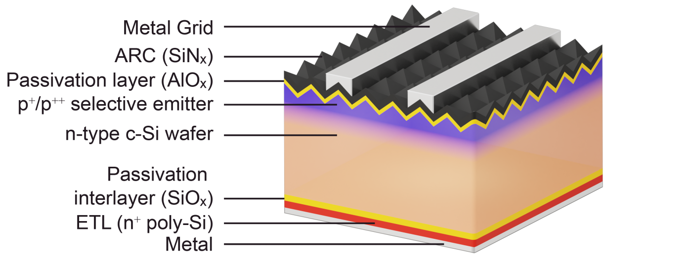

1. **Metal Grid（金属栅线）**：位于最上层，用于收集光生载流子（电子），实现电流导出。
2. **ARC（SiNₓ，减反层）**：减少光线反射，增加光吸收效率，提升电池光电转换性能。
3. **Passivation layer（AlOₓ，钝化层）**：降低硅片表面缺陷导致的载流子复合，提升电池开路电压和转换效率。
4. **p⁺/p⁺⁺ selective emitter（选择性发射极）**：通过掺杂形成高低浓度 p 型层，优化电极接触，减少电阻损耗。
5. **n-type c-Si wafer（n 型单晶硅片）**：作为电池基底，提供光吸收和载流子生成的主体材料。
6. **Passivation interlayer（SiOₓ，钝化夹层）**：进一步钝化硅片底部表面，减少载流子复合。
7. **ETL（n⁺ poly-Si，n 型多晶硅电子传输层）**：促进电子传输，同时增强底部钝化效果。
8. **Metal（金属层）**：作为底部电极，收集电子并形成电流回路，完成电能输出。

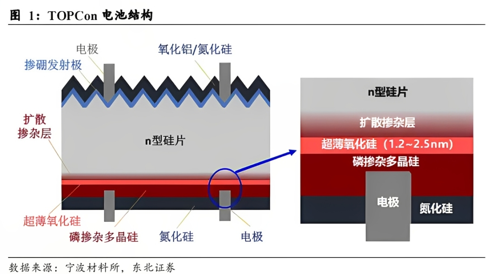

## TOPcon中的隧穿

> 丁东.晶硅TOPCon与IBC太阳电池设计、制备与性能[D].上海交通大学,2021.DOI:10.27307/d.cnki.gsjtu.2021.000111.
>
> > TOPCon 结构由一层**超薄隧穿氧化层**和掺杂多晶硅层组成，可以为硅片背面提供优越的表面钝化，**超薄氧化层在使多子电子隧穿进入掺杂多晶硅的同时能阻挡少子空穴复合**，进入多晶硅的电子横向传输被金属电极收集，该结构由于避免了金属半导体的直接接触，可以极大降低金属接触区域载流子复合，能显著提升电池的开压和效率。
>
> > 基于“**选择性势垒效应**”（即选择性地阻止一种载流子，同时有效地传输另一种载流子）的氢化非晶硅（a-Si:H）或隧穿氧化钝化接触（TOPCon）结构都是提供钝化接触的有效方法。

> 任程超,周佳凯,张博宇,等.基于隧穿氧化物钝化接触的高效晶体硅太阳电池的研究现状与展望[J].物理学报,2021,70(17):294-304.
>
> > 对于超薄隧穿氧化层，目前学术界存在两种载流子传输理论：
> >
> > 第一种是**量子隧穿效应**。即电子等微观粒子在势垒高度大于粒子能量的条件下仍可以概率性的穿过势垒到达另一侧；
> >
> > 第二种是**针孔(pinhole)理论**。当氧化层超过2nm后，载流子隧穿的几率会大大降低，此时载流子主要通过针孔来传输。

> Kim, YJ., Kweon, I.S., Min, K.H. et al. Thermal annealing effects on tunnel oxide passivated hole contacts for high-efficiency crystalline silicon solar cells. Sci Rep 12, 15024 (2022). https://doi.org/10.1038/s41598-022-18910-5
>
> > “然而，已有研究表明，TOPCon结构的工作原理**并非仅依赖于隧穿机制**，**还必须考虑氧化层中针孔或纳米孔的传导作用**。”
> >
> > > “However, it has been reported that the tunnel mechanism is not the only working principle in the TOPCon structure; conduction via pinholes or/and nanopits within the oxide layer must also be considered.”

> Peibst R, Römer U, Larionova Y, et al. Working principle of carrier selective poly-Si/c-Si junctions: Is tunnelling the whole story?[J]. Solar energy materials and solar cells, 2016, 158: 60-67.
>
> > 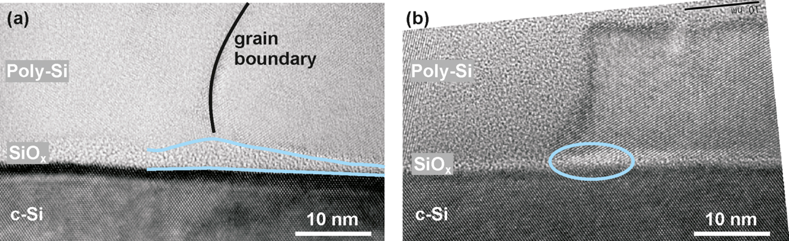
> >
> > n⁺多晶硅 / 单晶硅（c-Si）结在 1050°C 下形成结后的高分辨率透射电子显微镜（TEM）横截面图像，其中（a）显示界面氧化物厚度的局部变化，（b）显示多晶硅与单晶硅衬底晶格的局部直接接触，这可能表明针孔形成。（a）的初始界面氧化物厚度约为 2.4 nm，（b）约为 1.7 nm。两者的 J₀值分别为：（a）10 fA/cm²，（b）20 fA/cm²。
>
> 图中的 **pinhole（针孔）是物理存在的结构缺陷**。在 n⁺ poly-Si/c-Si 结中，理想情况下 SiOₓ氧化层应均匀覆盖单晶硅（c-Si）表面，起到钝化或绝缘作用。但制备过程中，若氧化层局部未完整形成（如厚度不足、覆盖不均），会导致多晶硅（poly-Si）与单晶硅衬底直接接触，形成微小孔洞状缺陷，即针孔。
>  这种针孔会破坏氧化层的隔离功能，增加界面漏电流（如图中 b 的 J₀值更高，达 20 fA/cm²），是影响器件性能的物理结构缺陷。

# **HJT（SHJ)**：本征薄膜异质结

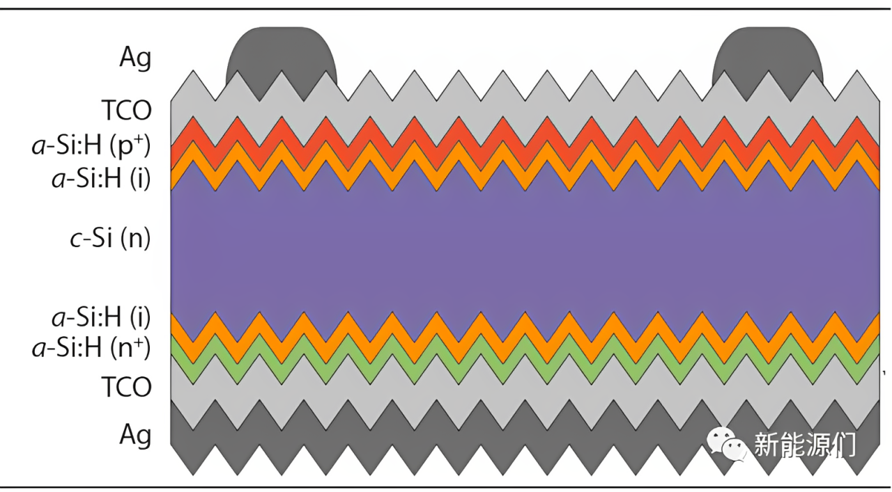

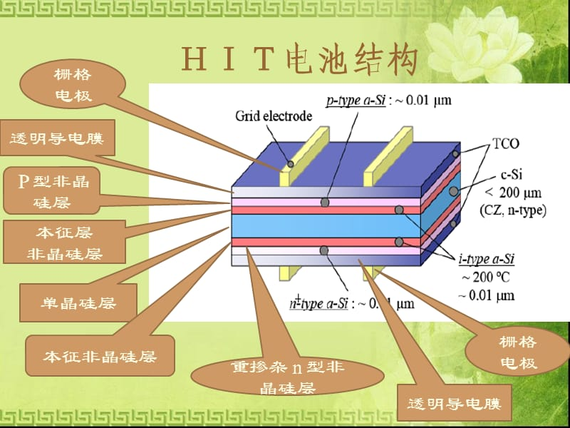

> 丁东.晶硅TOPCon与IBC太阳电池设计、制备与性能[D].上海交通大学,2021.DOI:10.27307/d.cnki.gsjtu.2021.000111.
>
> > 异质结太阳电池具有较高的光电效率、组件户外运行稳定和衰减系数低等**优点**，高效率的原因除了采用高少子寿命的n型单晶作为衬底材料，还可以归纳为以下几点：
> >
> > ①本征非晶硅a-Si:H(i)层具有较高的能带结构（\~1.72eV）,与晶硅衬底（能带\~1.12eV）会形成较高的势垒差，所形成的p-n结具有较高的势垒高度，在选择性传输载流子的同时能极大降低界面复合损失，从而获得很高的开路电压（最高能达到\~750mV）；
> >
> > ②本征非晶硅a-Si:H(i)层和掺杂发射极a-Si:H(p)或背表面场a-Si:H(n)层的制备可在温度为200℃的高真空腔室内共同完成，不仅避免了高温条件对硅片的损伤，而且避免了空气条件下对非晶硅材料界面造成氧化等不利影响，所以基底材料少子寿命不会降低，同时低温工艺可使非晶硅薄膜的沉积速率、光学带隙、吸收系数以及氢含量得到较精确的控制；
> >
> > ③沉积的a-Si:H(i)层内含有大量氢原子，能有效钝化硅材料表面的悬挂键，降低单晶硅非晶硅界面缺陷态密度，以此减少复合中心的形成；
> >
> > ④SHJ电池正反两面具有对称结构，降低了本征非晶硅a-Si:H(i)和发射极a-Si:H(p)或背表面场a-Si:H(n)的机械应力和应变，因此硅片可向薄片化发展，较薄的硅片再配合良好的陷光绒面，能使少数载流子更容易扩散到硅片表面，从而被金属电极收集；
> >
> > ⑤硅片制绒过程中采用碱制绒方法可形成随机分布的小绒面金字塔，可降低入射光的反射损失，从而增加衬底材料的吸光效率；
> >
> > ⑥SHJ的双面对称结构可以做成双面双玻组件，在正面发电的同时也充分利用电池背面的反射光，增加组件带来的效率增益（一般提高10%~30%）；
> >
> > ⑦在SHJ电池正表面沉积TCO（Transparentconductingoxide）结构，甚至在电池正反两面均制备TCO结构，电荷不会在表面TCO层产生极化现象，不存在光致衰减（Lightinduceddegradation,PID）现象，具有长期稳定发电的优势。
> >
> > ## 工艺
> >
> > 制备SHJ电池一般以少子寿命较高的n型单晶硅作为基底，硅片电阻率\~1Ω‧cm，厚度在80\~160μm，在硅片正表面先沉积厚度小于10nm的本征非晶硅（写为a-Si:H(i)），再沉积一层硼掺杂的非晶硅（写为a-Si:H(p)）以形成P-N结（沉积温度<200℃）；在基底背表面同样先沉积厚度小于10nm的a-Si:H(i)层，再沉积一层磷掺杂的a-Si:H(n)层作为背表面场，沉积有非晶硅的正反两侧覆盖透明导电氧化层（TCO）用于载流子的收集，最后通过丝网印刷方法在两侧印刷低温正负电极浆料（<250℃）
> >
> > 异质结太阳电池制备工艺主要包括硅片的清洗制绒、正反两面本征非晶硅和掺杂非晶硅薄膜的沉积、透明导电氧化层的沉积以及金属电极的制备。

# BC中的隧穿

在背接触（BC）结构中，具有类似于旁路二极管的反向偏置功能。

BC电池在**反向偏压**下**隧穿**，允许载流子隧穿导通，从而降低击穿电压，实现导通。

这种设计可在不显著牺牲电池效率的前提下，提升阴影耐受性。

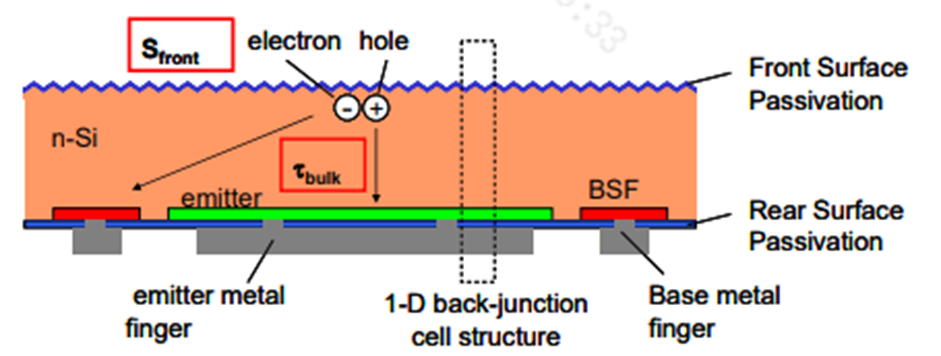

> Calcabrini A, Moya P P, Huang B, et al. Low-breakdown-voltage solar cells for shading-tolerant photovoltaic modules[J]. Cell Reports Physical Science, 2022, 3(12).
>
> > 交叉指式背接触（IBC）太阳能电池后表面的背表面场（BSF）和发射极（emitter）之间自然形成的结，可以在太阳能电池**反向偏置**时旁通该太阳能电池。
> >
> > > developments in interdigitated back contact (IBC) solar cells offer new possibilities.**In** **this case, the junction that naturally forms between the back surface field (BSF) and the emitter on the rear side of an IBC solar cell can allow bypassing the solar cell when it is reverse biased.**
> >
> > 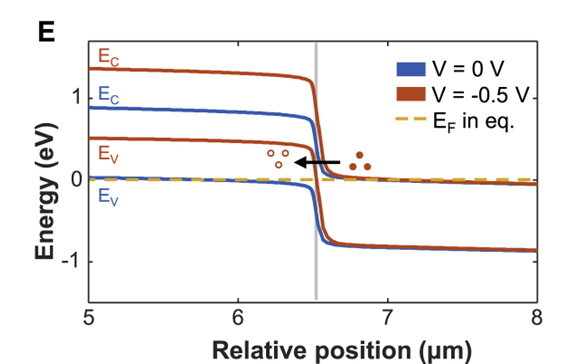
> >
> > 图1E模拟能带图表明，当电池处于**反向偏置**工作区域时，**隧穿**势垒降低，使得外部电路注入到n+区域的电子能够与p+区域的空穴复合。
> >
> > > The simulated band diagrams in the dark along the poly-Si region in Figure 1E show that, as the solar cells **are driven into the reverse-bias operating region, the tunneling barrier reduces, allowing electrons injected by the external circuit into the n+ region to recombine with holes in the p+ region.**

> 隆基绿能科技股份有限公司。一种背接触电池及光伏组件: CN119630068A[P]. 2025-03-14.
>
> > (57)摘要
> >
> > 本发明公开一种背接触电池及光伏组件，涉及光伏技术领域，**以降低背接触电池的反向击穿电压**的同时，有效控制背接触电池的漏电损耗。 
> >
> > **[0003]** 背接触电池是指电池片的向光面无电极，正、负电极均设置在电池片背光面一侧的太阳能电池，从而可以减少电极对电池片的遮挡，增加电池片的短路电流，提高电池片的能量转化效率。具体的，**现有的背接触电池中共同位于背光面一侧且导电类型相反的两个掺杂层之间会通过断续的间隔区域部分隔离开，以降低背接触电池的反向击穿电压**，从组件端降低热斑风险。
> >
> > **[0004]** 但是，现有的背接触电池中间隔区域未被断开的部分沿自身延伸方向的宽度设置不合理，导致从电池端来看，背接触电池的漏电流较大，进而使得背接触电池的工作效率较差。 

# HBC：异质结背接触

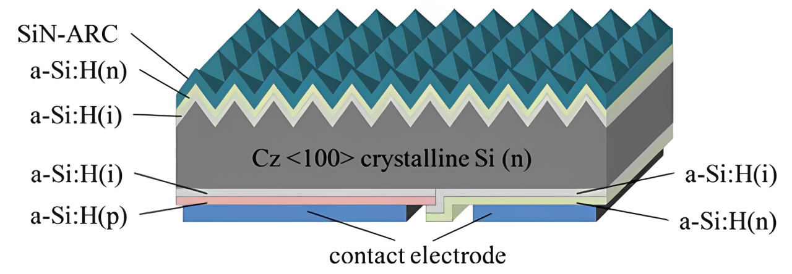

- **SiN-ARC**：氮化硅减反层，减少光反射，提升光吸收效率。
- **a-Si:H(n)**：n 型氢化非晶硅层，参与构建电池内的电学结区。
- **a-Si:H(i)**：本征氢化非晶硅层，作为钝化层，降低硅表面载流子复合，提升电池性能。
- **Cz <100> crystalline Si (n)**：n 型 <100> 晶向的直拉单晶硅，是电池实现光电转换的主体材料。
- **contact electrode**：接触电极，用于收集电池产生的光生载流子并传导电流。

- **AR layer**：增透层，用于减少光反射，增加光吸收；
- **Front a-Si passivation**：正面非晶硅钝化层，降低表面复合，提升电池效率；
- **c-Si**：晶体硅，作为电池的主体材料，承载光电转换功能；
- **Rear i:a-Si passivation**：背面本征非晶硅钝化层，起到背面钝化作用；
- **P:a-Si/N:a-Si**：P 型和 N 型非晶硅层，用于形成 PN 结，实现载流子分离；
- **Electrode pattern**：电极图案，收集并传导光生载流子。

# 基础化学

| **类别**       | **读音**            | **分类依据**                    | **典型示例（化学式）**                       |
| -------------- | ------------------- | ------------------------------- | -------------------------------------------- |
| **烃类**       | tīng                | 仅含 C、H                       |                                              |
| 烷烃           | wán                 | 单键（C-C），饱和链烃           | 甲烷（CH₄）、乙烷（C₂H₆）                    |
| 烯烃           | xī                  | 双键（C=C），不饱和链烃         | 乙烯（C₂H₄）、丙烯（C₃H₆）                   |
| 炔烃           | quē                 | 三键（C≡C），不饱和链烃         | 乙炔（C₂H₂）、丙炔（C₃H₄）                   |
| 芳香烃         | fāng xiāng tīng     | 苯环结构（六元共轭体系）        | 苯（C₆H₆）、甲苯（C₇H₈）                     |
| **含氧衍生物** |                     | 含 C、H、O                      |                                              |
| 醇             | chún                | 羟基（-OH）连接脂肪链           | 乙醇（C₂H₅OH）、甲醇（CH₃OH）                |
| 酚             | fēn                 | 羟基（-OH）直接连接苯环         | 苯酚（C₆H₅OH）、对苯二酚（C₆H₄(OH)₂）        |
| 醚             | mí                  | 醚键（-O-）连接两个烃基         | 乙醚（C₄H₁₀O）、甲基叔丁基醚（C₅H₁₂O）       |
| 醛             | quán                | 醛基（-CHO）                    | 甲醛（CH₂O）、乙醛（C₂H₄O）                  |
| 酮             | tóng                | 酮基（-CO-）                    | 丙酮（C₃H₆O）、环己酮（C₆H₁₀O）              |
| 羧酸           | suān                | 羧基（-COOH）                   | 乙酸（C₂H₄O₂）、甲酸（CH₂O₂）                |
| 酯             | zhǐ                 | 酯基（-COO-）                   | 乙酸乙酯（C₄H₈O₂）、甲酸甲酯（C₂H₄O₂）       |
| 酸酐           | gān                 | 两分子羧酸脱水形成（-CO-O-CO-） | 乙酸酐（C₄H₆O₃）、邻苯二甲酸酐（C₈H₄O₃）     |
| 环氧化合物     | huán yǎng huà hé wù | 三元环醚结构（环氧基）          | 环氧乙烷（C₂H₄O）、环氧丙烷（C₃H₆O）         |
| 过氧化物       | guò yǎng huà wù     | 过氧键（-O-O-）                 | 过氧乙酸（C₂H₄O₃）、过氧化苯甲酰（C₁₄H₁₀O₄） |
| **羧酸衍生物** |                     | 含羧基及其他官能团              |                                              |
| 羟基酸         | qiǎng jī suān       | 羟基（-OH）与羧基（-COOH）共存  | 乳酸（C₃H₆O₃）、苹果酸（C₄H₆O₅）             |
| 酮酸           | tóng suān           | 酮基（-CO-）与羧基（-COOH）共存 | 丙酮酸（C₃H₄O₃）、草酰乙酸（C₄H₄O₅）         |
| 内酯           | nèi zhǐ             | 环状酯（羧酸分子内脱水形成）    | γ- 丁内酯（C₄H₆O₂）、香豆素（C₉H₆O₂）        |

# 胶膜

## **预交联**

**预交联**是通过**紫外光（UV）或热固化**使胶膜部分交联，形成 “半固化” 状态，从而控制层压时的流动性。

## **预交联度**

**预交联度**指胶膜中已交联部分的比例（通常用百分比表示），是衡量预交联程度的核心参数。

## 乙烯 - 醋酸乙烯酯共聚物（EVA）

化学式：—[CH₂-CH₂]ₘ—[CH₂-CH(OOCCH₃)]ₙ— 

或简化为分子式组合：(C₂H₄)ₘ·(C₄H₆O₂)ₙ

其中：

- C₂H₄ 代表乙烯（Ethylene）单体单元，
- C₄H₆O₂ 代表醋酸乙烯酯（Vinyl Acetate）单体单元，

### **VA 含量**

是指乙烯 - 醋酸乙烯酯共聚物（EVA）中**醋酸乙烯酯（Vinyl Acetate，简称 VA）的质量百分比**

## 硫化曲线分析

硫化曲线是指在恒定温度下，通过硫化仪等设备测定橡胶在硫化过程中某一物理性能随硫化时间变化的曲线。这些物理性能包括转矩、拉伸强度、断裂伸长率、硬度等，其中以硫化仪测定的转矩 - 时间曲线最为常见，转矩可间接反映胶料的交联程度、硬度或定伸应力。

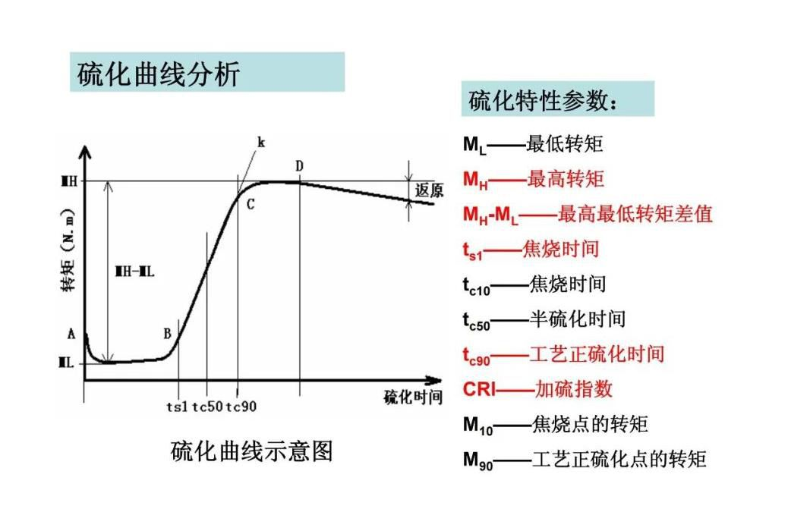

| 字母         | 名称           | 定义与意义                                                   |
| ------------ | -------------- | ------------------------------------------------------------ |
| $M_L$        | 最低转矩       | 胶料未硫化时的初始粘度，$M_L$ 越低，表明胶料流动性越好。     |
| $M_H$        | 最高转矩       | 交联密度达到峰值时的转矩，反映硫化胶的硬度和定伸强度，数值越高，相关性能越显著。 |
| $\Delta M$   | 转矩差         | $\Delta M = M_H - M_L$，与交联密度成正比。$\Delta M$ 越大，硫化胶物理性能提升越明显。 |
| $t_{s1}$     | 焦烧时间       | 定义1：从试验开始到转矩上升 $1\ \text{dN} \cdot {m}$ 的时间（单位：分钟），体现胶料加工初期的稳定性。 |
| $t_{c10}$    | 焦烧时间       | 定义2：转矩达到 $M_L + 10\% \Delta M$ 的时间                 |
| $t_{c50}$    | 半硫化时间     | 转矩达到 $M_L + 50\% \Delta M$ 的时间，用于评估硫化速度，反映胶料硫化进程的中间阶段。 |
| $t_{c90}$    | 工艺正硫化时间 | 转矩达到 $M_L + 90\% \Delta M$ 的时间，是实际生产中控制硫化程度的核心参数，确保硫化胶性能达标。 |
| $\text{CRI}$ | 加硫指数       | 硫化速度的量化指标，值越大表示硫化速度越快。计算公式为：$\text{CRI} = \frac{100}{t_{c90}-t_{s1}}$ |

# 常见英文缩写

|  缩写  |                        英文                        |                             含义                             |
| :----: | :------------------------------------------------: | :----------------------------------------------------------: |
| TOPCon |          Tunnel Oxide Passivated Contact           |                      隧穿氧化层钝化接触                      |
|  PERC  |          Passivated Emitter And Rear Cell          |                      钝化发射极背面电池                      |
|  HJT   |      Heterojunction with Intrinsic Thin Layer      |                        本征薄膜异质结                        |
|  SHJ   |               Silicon heterojunction               |                            异质结                            |
|  IBC   |            Interdigitated Back Contact             |                        交叉指式背接触                        |
|  HBC   |            Heterojunction Back Contact             |                         异质结背接触                         |
|        |                                                    |                                                              |
|  FSF   |                Front surface field                 |                           前表面场                           |
|  BSF   |                 Back surface field                 |                           背表面场                           |
|  TCO   |            Transparent conducting oxide            |                        透明导电氧化层                        |
|        |                                                    |                                                              |
|  PVD   |             Physical vapor deposition              |                         物理气相沉积                         |
| HWCVD  |         Hot wire chemical vapor deposition         |                       热丝化学气相沉积                       |
| PECVD  |     Plasma enhanced chemical vapor deposition      |                   等离子体增强化学气相沉积                   |
|  RPD   |             Reactive plasma deposition             |                       反应等离子体沉积                       |
|        |                                                    |                                                              |
|   PL   |                 Photoluminescence                  |                           光致发光                           |
|   EL   |                 Electroluminescent                 |                           电致发光                           |
|  MQT   |                Module Quality Test                 |                         组件质量测试                         |
|  MST   |                 Module Safety Test                 |                         组件安全测试                         |
|   TC   |                Thermal cycling test                |                     热循环测试（MQT 11）                     |
|   HF   |                Humidity-freeze test                |                      湿冻试验（MQT 12）                      |
|   DH   |                   Damp heat test                   |                      湿热测试（MQT 13）                      |
|  PID   |           Potential Induced Degradation            |                    电位诱导衰减（MQT 21）                    |
|  LID   |             Light-Induced Degradation              |                           光致衰减                           |
| LeTID  | Light And Elevated Temperature Induced Degradation |                光照及高温过程中引起的功率衰减                |
|   UV   |                    Ultraviolet                     |            紫外  待补充             |
|   MC   |          待补充           |               待补充                |
|        |                                                    |                                                              |
|  EPE   |               ExpandablePolyethylene               |                   可发性聚乙烯，又称珍珠棉                   |
|  EVA   |               Ethylene Vinyl Acetate               | 乙烯-醋酸乙烯共聚物 （也称之为乙烯-乙酸乙烯共聚物） 是由乙烯（E）和乙酸乙烯（VA）共聚而制得 |
|  EEA   |              Ethylene Ethyl Acrylate               |                       乙烯-丙烯酸乙酯                        |
|   PA   |                     Polyamide                      |                            聚酰胺                            |
|  TPT   |                 Tedlar/PET/Tedlar                  |                        聚氟乙烯复合膜                        |
|  PET   |             Polyethylene terephthalate             |                      聚对苯二甲酸乙二酯                      |
|        |                                                    |                                                              |
|  DOE   |                Design of Experiment                |                           试验设计                           |
|        |                                                    |                                                              |

## LID vs LeTID

参考

> 20230801-TUV-可靠性标准机理及失效分析交流会议-LeTID test specification-Risen.pdf

| 光衰种类 | 电池片                             | 光衰原因                                                     | 特性                                                         | 消除方案                                                 |
| :------- | :--------------------------------- | :----------------------------------------------------------- | :----------------------------------------------------------- | :------------------------------------------------------- |
| LID      | 多发生于P型电池 常规单晶>多晶 | BO对（硼氧缺陷对）的形成                                     | 1、无硼消失, 2、低氧下降 3、随时间延长衰减逐渐增加，后趋于稳定 | 掺Ga，低氧工 低剂量辐照+退火 低剂量电流注入+退火 |
| LeTID    | 多发生PERC电池 多晶>单晶       | 可能机理： 1、金属杂质 （不同位置） 2、背面钝化氢环境导致很多缺陷被氢钝化，光照和高温下氢键容易断裂 | 1、与B/O关系不大 2、通常温度>50℃比较明显 3、随时间延长衰减增加，后逐渐恢复，后趋于稳定 4、测试温度越高，恢复越快 | 1、P/Al吸杂; 2、降低烧结温度 3、高强度激光退火   |

[参考](https://guangfu.bjx.com.cn/news/20200928/1107419.shtml)

# 组件编码方式

## 产品型号编码方式

|      |   XXX    |                             XXX                              |   -    |                 X                  |   -    |   XXX    |                             XXX                              |
| :--: | :------: | :----------------------------------------------------------: | :----: | :--------------------------------: | :----: | :------: | :----------------------------------------------------------: |
| 含义 | 日升组件 |                          电池片数量                          | 分隔符 |             电池片尺寸             | 分隔符 | 功率分档 |                           组件工艺                           |
| 示例 |   RSM    | 40 60 72 100 108 110 120 144 150 81 68 132 156 |   -    | 6 7 8 9 10 11 |   -    |   xxx    | M MDG BMDG HDG BHDG P PDG MI MB N NB BNDG NDGB HDGB BMTG |

例如：RSM60-6-330M 代表日升60片6英寸156.75或158.75电池片330瓦单玻单晶组件。

参数释义

电池片尺寸

| 电池片尺寸 |              含义              |
| :--------: | :----------------------------: |
|     6      | 6 英寸 156.75 或 158.75 电池片 |
|     7      |           166 电池片           |
|     8      |           210 电池片           |
|     9      |           182 电池片           |
|     10     |        192R 矩形电池片         |
|     11     |        210R 矩形电池片         |

组件工艺

| 组件工艺 |                含义                |
| :------: | :--------------------------------: |
|    M     |            单玻单晶组件            |
|   MDG    |          单面双玻单晶组件          |
|   BMDG   |          双面双玻单晶组件          |
|   HDG    |                                    |
|   BHDG   |         双面双玻异质结组件         |
|    P     |            单玻多晶组件            |
|   PDG    |          单面双玻多晶组件          |
|    MI    |            单晶智能组件            |
|    MB    |            单晶全黑组件            |
|    N     |       单玻 N 型 TOPCon 组件        |
|    NB    |     单玻 N 型 TOPCon 全黑组件      |
|   BNDG   |   单面/双面双玻 N 型 TOPCon 组件   |
|   NDGB   | 单面/双面双玻全黑 N 型 TOPCon 组件 |
|   HDGB   |      单面/双面双玻全黑异质结       |
|   BMTG   |        双面透明背板单晶组件        |

## 组件条码编码

|         XX          |         XX          |        XX        |     \|     |    XX    | XXXXX  |
| :-----------------: | :-----------------: | :--------------: | :--------: | :------: | :----: |
| 年代号：生产年份+25 | 月代号：生产月份+11 | 日代号：生产日期 | 防伪识别码 | 车间代号 | 流水号 |

例如：431201I0100001 代表 2018 年 1 月 1 日组件一车间生产的第一个组件。

# 组件制作流程

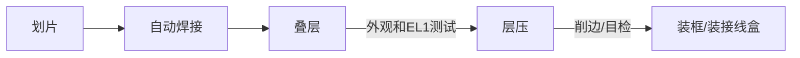

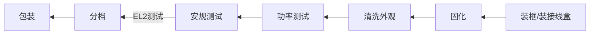

# 实验室测试流程

- OA 填写（材料）测试申请单
- 个人所在部门经理审批
- 实验室石经理审批
- 样品送至实验室门口，并放置测试申请单
- 实验室核对样品以及测试申请单
- 样品外观检查，无误后接受

# 光伏组件测试标准

## IEC61215

### 测试时长

| 项目                                  |                                                              |                                   |
| ------------------------------------- | ------------------------------------------------------------ | --------------------------------- |
| PID96 PID192                     | 96小时 192小时                                          | 4天 8天                      |
| HF10 HF20                        | 10个循环，24h/循环 20个循环，24h/循环                   | 10天 20天                    |
| TC50 TC100 TC200 TC400 | 50，4h/循环 100，4h/循环 200个循环，4h/循环 400个循环，4h/循环 | 9天 17天 34天 68天 |
| DH500 DH1000 DH2000         | 500小时 1000小时 2000小时                          | 21天 42天 84天          |
| UV15 UV30 UV60              | 15kWh，若200W，则75h 30kWh，若200W，则150h 60kWh，若200W，则300h | 3天3小时 7天 14天       |
| UV序列： UV15+DML+TC50+HF10      |                                                              | 4+ +9+10=23天                     |

### MQT01  外观检测

不低于 1000 lux 的照度下，对每一个组件仔细检查

### MQT02  最大功率确定

最大功率确定  Maximum power determination

700~1100 $\rm{w/m^2}$

25~50℃

### MQT03 绝缘测试

确定模块在带电部件和可触及部件之间是否有充分的绝缘。

- 耐压

61215：$60s \ \ 1000+2*V_{sys}$

61730：$60s \ \ 2000+4*V_{sys}$

- 绝缘

$120s \ \ V_{sys}$

### MQT04  温度系数的测量

测试点位数：$8$ （每 5℃一个点位）

温度区间：$25~60$℃

开路电压 $V_{oc}$ 系数字母为 $β$

短路电流 $I_{sc}$ 系数字母为 $α$

最大功率 $P_{max}$ 系数字母为 $γ$。

### MQT05

  标称模块工作温度(NMOT)测试

（在2021版意味着取消）

### MQT06  STC下的性能

确定在STC (1000 $\rm{w/m^2}$，25℃ 电池温度，IEC60904-3参考太阳光谱辐照度分布)下模块的电性能如何随负载变化。

根据SOP组件温度为25±1℃，测试光强为1000 $\rm{w/m^2}$，根据IEC61215-2:2016，组件温度为25±2℃，AM：1.5。

要求：

- 样品恒温：0.5h，可靠：4h，标片：24h

- 检查组件（标片）的外观
- 校准标片：$I_{sc},V_{oc},P_{max}$
- 连续闪三次，插拔线后，再闪一次，差值小与 0.5W
- 测被测组件
- 整理

### MQT07  低辐照度下的性能测试

测试光强200 $\rm{w/m^2}$，假如组件的实测功率为600W，低射照度下的测试值为116W，低辐照度系数为96.67%。

实测功率为600W时为1000 $\rm{w/m^2}$，则低辐照度系数=116/(600*200/1000)=96.67%

### MQT08  室外暴晒

在室外进行：在宁海，组件摆放角度为29±5°，光强需要达到至少500 $\rm{w/m^2}$以上才能采纳数据，累计辐照度达到$60\ \rm{kwh/m^2}$。

### MQT09  热斑耐久试验

Hot-spot endurance test

- 一块组件需要选取4片电池片，其中3片为漏电流最高的电池片，至少保证1片在边框附近，1片为漏电流最低电池片。
- 最佳阴影遮挡面积判定为阴影遮挡后的电流与组件初始状态下的Impp相近。如果二极管不启动的情况下，100%或完全遮挡面积为最坏遮挡面积。
- 测试时组件为短路状态（开路，短路，接负载），组件温度需在50±10℃，如光照一个小时后，电池片温度仍然在上升，需再进行4小时光照。

### MQT10 紫外试验

UV预处理试验

测试时组件温度为（60±5）℃，紫外累计辐照量需达到$15 \ \rm{kwh/m^2}$。UVA的波段为320 ~ 400nm，UVB的波段为280 ~ 320nm，根据IEC61215-2：2016，UVB含量占总UV的3%~10%。

目的：在进行热循环/湿冻测试之前，对组件进行紫外辐射预处理，以识别易受紫外线影响老化的材料和粘合剂。注:MQT 10旨在检测对紫外线老化的总体敏感性，因为与组件的典型寿命预期相比，该剂量较小，而且UV的波长分布没有严格规定。将MQT 10应用于其他目标(例如比较退化研究)时应该考虑实现这些目标需要哪些进一步的需求。
▪	紫外光辐照仪：波长范围为280nm ~ 320nm和320nm ~ 400nm，不确定度±15%或更好，辐照度均匀性±15% 且没有明显的辐照度低于280纳米波长的紫外光
▪	组件短路或开路。在测试报告中注明
▪	对于柔性模块，测试期间应根据制造商的文件，使用规定的基材和粘合剂或附件/安装方式安装。
▪	组件正面总紫外线照射至少$15 \ \rm{kwh/m^2}$，在280 nm和400 nm之间的波长范围至少有3%，在280 nm和320 nm之间的波长不超过10%
▪	组件温度在规定范围内(60±5)°C
▪	对于双面组件，重复紫外线照射背面的程序
▪	重复MQT 01 和MQT 15

### MQT11  热循环测试（TC）

测试温度为-40℃到85℃，组件在-40℃~80℃区间内通Impp电流，在其他区域通小于1%Impp电流。

### MQT12  湿冻测试（HF）

组件在85℃ 85%RH条件下需保持至少20h，在-40℃时需保持至少30min时间。测试过程中，需通0.5%Impp电流。

### MQT13  湿热测试（DH）

组件的测试环境条件为85℃ 85%RH需要防止组件的端子进水汽，从而可能产生影响组件功率的因素，测试后组件需在开路状态下23±5℃，相对湿度小于75%RH，恢复2~4小时。

### MQT14  引线端强度试验

**Retention of junction box on mounting surface**

### MQT15  湿漏电流试验

**Wet leakage current test**

水温（22±2）℃，电阻率≤3500Ω/cm，假设组件为2384*1103，限定电阻值为15.20MΩ，测试前设备应进行自检，测试时间为120s。

限定值计算，if 组件面积S<0.01，限定值为400MΩ，else 限定值为 40/S

### MQT16  机械载荷试验

**Static mechanical load test**

测试环境温度要求（25±5）℃，需对样品进行缓慢施压，测试期间监控电流不能中断，载荷均匀性要优于5%，且每个面要进行3小时施压。假设组件的设计载荷为2400Pa，安全因子为1.5，实际测试载荷为3600Pa。

### MQT17  冰雹试验

冰球制作需要在（-10±5）℃进行，冰球制作后需要在（-4±2）℃环境下，储存至少1h时间，且在60s时间内，完成冰球的测量，并发射。

冰球的直径、质量、速度的允差为5%。测速设备距离样品不得超过1m距离。

### MQT18  旁路二极管热性能测试

二极管需在30℃、50℃、70℃、90℃温度下，测试二极管压降，算出Ud和Tj的对应关系（最小二乘法）。然后再75℃下$I_{sc}$电流，持续1h时间，得出二极管压降Ud，套入上述的最小二乘法关系中，算的二极管结晶。

### MQT19  稳定性测试

测试时组件接负载状态（开路、短路、接负载）。测试时组件温度（50±10）℃，每次5kwh/m2累计辐照量，至少2次。评估组件是否达到电力稳定状态下功率输出的合格判据$\frac{P_{max}-P_{min}}{P_{average}}<1 \rm{\%}$。

## IEC61730

